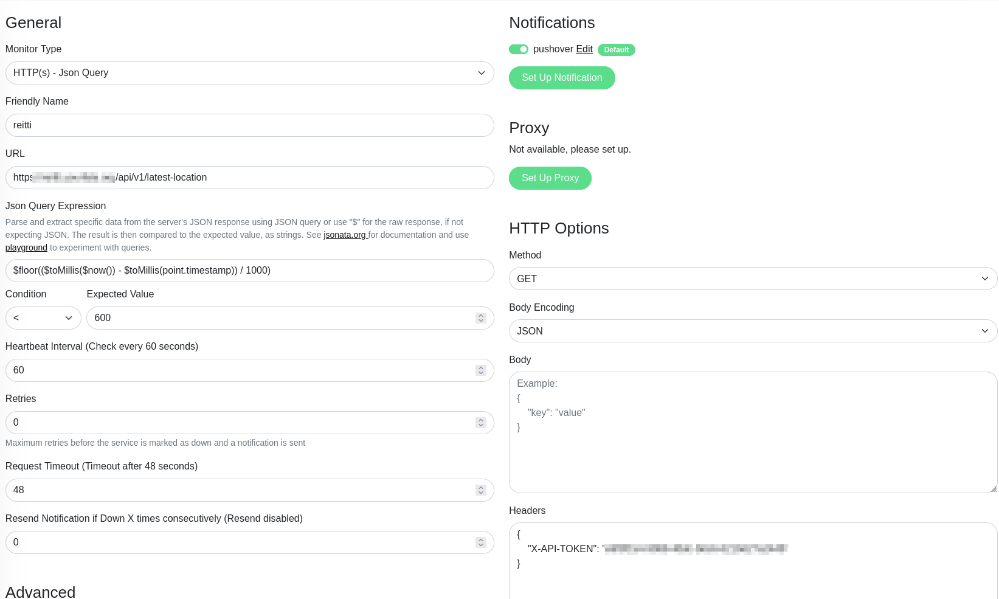

|since|v1.6.0|.version-badge|

The Latest Location API endpoint allows you to verify if location data is actively flowing into Reitti for a specific user.

### Endpoint

```
GET /api/v1/latest-location
```

### Usage

This endpoint is particularly useful for:

- **Scripting**: Automated checks to ensure location tracking is working
- **Home Assistant Automations**: Create automations based on location data availability
- **Alerting Systems**: Set up notifications when location data stops flowing
- **Monitoring**: Regular health checks of your location tracking setup

### Authentication

Include your API token either as a header or query parameter:

```bash
# Using header
curl -H "X-API-TOKEN: your-api-token" https://your-reitti-instance/api/v1/latest-location

# Using query parameter
curl https://your-reitti-instance/api/v1/latest-location?token=your-api-token
```

### Query Parameters

| Parameter | Type   | Required | Description                                                                            |
|-----------|--------|----------|----------------------------------------------------------------------------------------|
| `since`   | string | No       | ISO 8601 datetime. When set, only points tracked at or after this time are considered. |

### Response

The endpoint returns a JSON response with information about the latest location data:

```json
{
  "point": {
    "latitude": 53.86329752,
    "longitude": 10.70105392,
    "timestamp": "2026-01-27T12:25:35Z",
    "accuracyMeters": 10.951032638549805,
    "elevationMeters": null,
    "valid": true
  },
  "hasLocation": true
}
```

#### Response Fields

- **point** (object, optional): The latest location point. Present only when `hasLocation` is `true`. Contains
  `latitude`, `longitude`, `timestamp`, `accuracyMeters`, `elevationMeters`, and `valid`.
- **hasLocation** (boolean): Indicates whether any location data exists for the user. If `false`, the `point` field will
  be absent.

### Examples

#### Uptime Kuma

You can monitor your location tracking reliability using [Uptime Kuma](https://github.com/louislam/uptime-kuma) with a **JSON Query** monitor type. This monitor periodically calls the Latest Location API and checks that fresh data is being received.

**Configuration steps:**

1. Add a new monitor in Uptime Kuma, select **JSON Query** as the monitor type.
2. Set the URL to your Reitti instance endpoint, including the API token:
   ```
   https://your-reitti-instance/api/v1/latest-location
   ```
3. Set the **Headers** field to:
   ```json
   { "X-API-TOKEN": "your-api-token" }
   ``` 
4. In the **JSON Query Expression** field, enter the expression that calculates the age of the latest point in seconds:
   ```
   $floor(($toMillis($now()) - $toMillis(point.timestamp))/1000
   ```
5. Set the **Condition** to **less than** and enter a value that defines your acceptable freshness window. For example, to alert if no fresh location data has arrived in the last 10 minutes:
   ```
   < 600
   ```
6. Set your expected check interval (e.g. every 5 minutes) and alerting preferences.



If no recent location data is available, the calculated age will exceed your threshold and Uptime Kuma will trigger an alert.

### What Can Be Achieved

- **Automated Monitoring**: Set up scripts that regularly check if your phone is sending location data
- **Smart Home Integration**: Use the response in Home Assistant to trigger automations when you're actively moving
- **Data Quality Assurance**: Ensure your location tracking is working consistently
- **Troubleshooting**: Quickly identify if there are issues with your mobile app or data flow