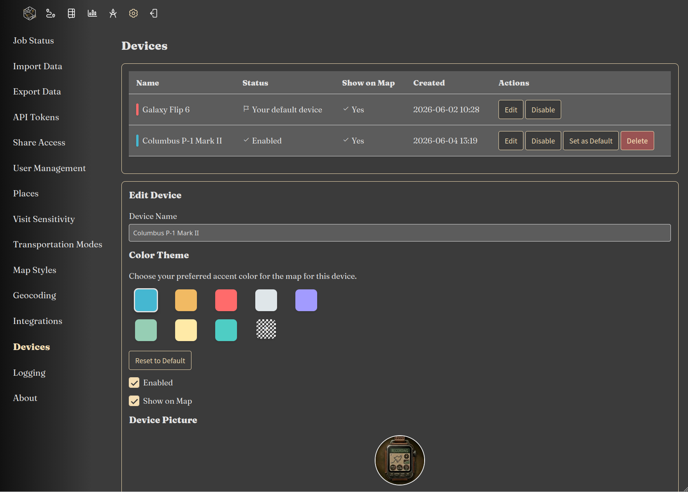

|since|v5.0.0|.version-badge|

Reitti v5 introduces **Devices** as a core concept for managing location data from multiple sources. Each device
represents a tracking source (e.g., a phone, a Home Assistant integration, or a custom script), allowing you to organize
and visualize data independently before merging it into your personal timeline.

### Why Use Devices?

Devices give you the flexibility to:

- **Track Multiple Sources**: Ingest location data from different apps, devices, or integrations simultaneously
- **Organize Your Data**: Keep sources separate until you are ready to combine them
- **Color-Code Paths**: Each device can have its own color, making it easy to distinguish sources on the map
- **Control Visibility**: Show or hide a device on the map with a single toggle
- **Disable Inactive Sources**: Prevent further data ingestion and hide the device from other parts of Reitti

### How It Works

1. When data is ingested into the **default device**, your personal timeline is automatically updated and recalculated.
2. For any **additional devices** you create, you need to **manually stitch** together slices of GPS data to merge them
   into your timeline. This is done in the [Workbench](../workbench/index.md).
3. The stitching process lets you select specific time ranges from a device and combine them with the default device's
   data, giving you full control over your final timeline.

### Configuration

To configure devices:

1. Navigate to **Settings > Devices**
2. You will see a list of all devices, including the default device created during migration
3. Configure each device's settings as desired
4. Save your settings to apply the configuration

### Device Settings

Each device has the following configurable properties:

- **Name**: A friendly name to identify the device (e.g., "Phone," "GPS Tracker," "Home Assistant," "Car Tracker")
- **Color**: The color used to draw the device's path on the map. Helps visually distinguish multiple sources
- **Show on Map**: A checkbox that enables or disables the device's visibility on the main map. Unchecked devices still
  ingest data, but their paths are hidden
- **Disabled**: Completely disables the device. When disabled:
    - Data cannot be ingested into the device
    - The device is hidden from other places in Reitti (e.g., **Settings > Integrations**)
    - The device's path is not shown on the map

### Default Device vs. Additional Devices

| Feature                       | Default Device | Additional Devices |
|-------------------------------|----------------|--------------------|
| **Auto-updates timeline**     | Yes            | No                 |
| **Manual stitching required** | No             | Yes                |
| **Can be disabled**           | Yes            | Yes                |
| **Can be renamed**            | Yes            | Yes                |
| **Colour-coded path**         | Yes            | Yes                |

### Best Practices

- **Use the default device for your primary tracking source**: This ensures automatic timeline updates without manual
  intervention
- **Create additional devices for secondary sources**: For example, a work phone, a shared family device, or a
  temporary tracker
- **Stitch data regularly**: If you use multiple devices, periodically merge their data in
  the [Workbench](../workbench/index.md) to keep your timeline complete
- **Name devices clearly**: Use descriptive names to easily identify each source
- **Disable unused devices**: Prevents accidental data ingestion and keeps your settings clean

### Data Merging

To stitch data from an additional device into your timeline:

1. Go to the [Workbench](../workbench/index.md)
2. Select the device you want to merge from
3. Choose the time slices of GPS data you want to include
4. Confirm the merge — the selected time slice will replace the data from your default device's timeline

Once merged, the data becomes part of your permanent timeline and is automatically recalculated alongside future default
device data.