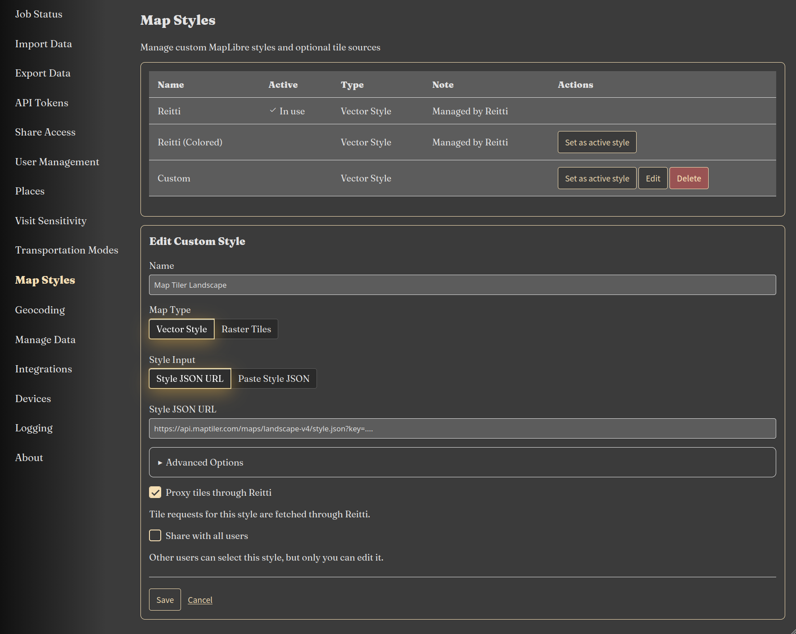

|since|v5.0.0|.version-badge|

Reitti v5 introduces **Map Styles** as a first-class configuration option, allowing you to customize the look and feel of your map. You can choose from built-in Reitti styles, create your own JSON-based styles, or use raster tile sources.

### Why Use Custom Map Styles?

Custom map styles let you:

- **Personalize Your Map**: Choose colors, fonts, and detail levels that suit your preferences
- **Optimize for Different Use Cases**: Use a dark style for low-light environments or a colorful style for better contrast
- **Integrate Professional Tile Services**: Use services like MapTiler, Mapbox, or self-hosted tile servers
- **Share Styles Across Users**: Admin users can prepare styles for less experienced users

### How It Works

1. Map styles define how tiles are rendered on the map – colors, labels, roads, water, and more
2. You can use one of the built-in Reitti styles or create your own
3. Styles can be JSON-based (Style JSON) or raster-based (tile URL templates)
4. Requests can be proxied through Reitti to leverage the built-in tile cache for faster load times

### Configuration

To configure map styles:

1. Navigate to **Settings > Map Styles**
2. Choose between **Built-in Styles** or **Custom Styles**
3. Configure your preferred settings
4Save your settings to apply the new style

### Built-in Styles

Reitti ships with two built-in styles:

- **Default Reitti**: A dark theme optimized for location data visualisation
- **Colored Reitti**: A lighter, more colorful variant with better contrast for certain environments

These styles are always available and cannot be deleted.

### Custom Styles

You can create your own map styles in two ways:

#### 1. JSON-based Styles

Style JSON follows the [MapLibre Style Specification](https://maplibre.org/style-spec/). You can either:

- **URL-based**: Provide a URL pointing to a hosted `style.json` document (e.g., from [MapTiler](https://cloud.maptiler.com/maps/))
- **Paste JSON**: Obtain the complete Style JSON (e.g., created with [Maputnik](https://maplibre.org/maputnik/)) and paste it directly into the **Style JSON** field

#### 2. Raster-based Styles

If you prefer a simple raster tile source, you can:

- **Tile URL Template**: Provide a tile URL template (e.g., `https://example.com/tiles/{z}/{x}/{y}.png`)
- **TileJSON URL**: Provide a URL to a `tile.json` document that defines the raster source

### Proxy Settings

You can choose whether all tile requests should be proxied through Reitti.

**Proxy enabled (recommended):**
- Tile requests pass through the built-in tile cache for faster subsequent load times
- Useful when using external tile services with rate limits or when you want to cache tiles locally

**Proxy disabled:**
- Tile requests go directly to the tile server
- No caching layer. Useful for local tile servers where caching is unnecessary

### Sharing Styles (Admin Only)

If you are an **admin user**, you can choose to share a custom map style with other users. This allows you to prepare a map style once and make it available to less experienced users, who can then select it from their own settings without needing to configure anything.

Shared styles appear automatically in other users' **Map Styles** settings. Users cannot modify or delete a shared style, but they can still select it for their own map.

### Capabilities: 3D Buildings, Terrain, and Satellite

If your custom Style JSON is configured correctly, Reitti will automatically detect and enable advanced map features such as 3D buildings, terrain, hillshading, and satellite overlay. No additional configuration is needed. Reitti scans the style and activates the relevant
controls.

The following elements must be present in your Style JSON for each capability to be recognized:

#### Terrain

- A **source** with `"type": "raster-dem"` must be defined in the `sources` object.
- A **layer** with `"type": "hillshade"` must be present in the `layers` array.

When both are detected, the 3D terrain toggle becomes available in the map view.

#### Satellite Layer

- A **raster source** with a URL or tile pattern typically containing `satellite` in the identifier or URL. Reitti checks for known satellite patterns in raster layers.

When a satellite layer is detected, the map view will enable the satellite overlay toggle.

#### 3D Buildings

- One or more **layers** with `"type": "fill-extrusion"` where either the layer `id` or `source-layer` contains the word `building` (case-insensitive).

When 3D building layers are found, the 3D buildings toggle becomes available in the map view.

**Note:** These capabilities are only available for **JSON-based styles** (URL or pasted JSON). Raster-based styles do not support these advanced features.

### Best Practices

- **Start with built-in styles**: Use the default or colored Reitti style before creating custom ones
- **Use Maputnik for JSON styling**: The [Maputnik editor](https://maplibre.org/maputnik/) is the recommended tool for visually designing Style JSON
- **Enable proxy for external tile services**: This reduces load times and respects rate limits
- **Share styles if you manage multiple users**: Create a consistent map experience across your instance
