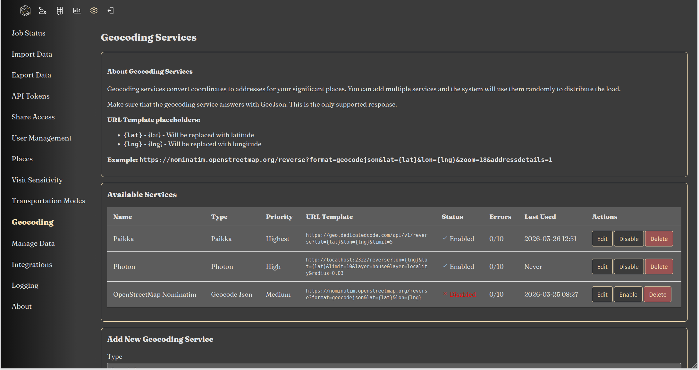
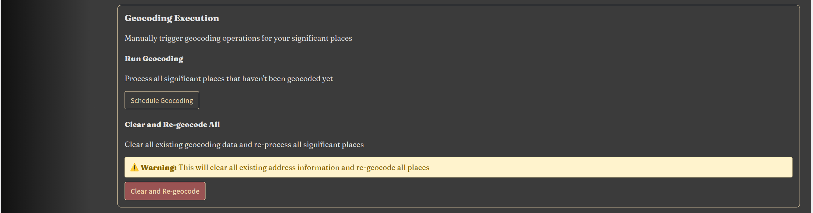

Reitti supports multiple reverse geocoding services to convert GPS coordinates into human-readable addresses. This feature enhances your location data by providing meaningful place names and addresses for your tracked locations.

## Configuration Interface



Reverse geocoding services are configured through the web interface at **Settings > Geocoding**. This interface allows you to:

- Add, edit, and remove geocoding services
- Set priority levels for each service
- Monitor service health and error rates
- Enable/disable services as needed

### Service Management

**Priority System:**

- Services are sorted by priority (highest to lowest) and then by name
- Reitti randomly selects one service from the highest priority tier
- If the selected service fails to respond, Reitti tries another service from the same priority tier
- If all services in a priority tier fail, Reitti moves to the next lower priority tier
- This ensures high availability and fallback capabilities

**Error Handling:**

- Each service displays its error count in the configuration table
- Services with more than 10 errors are automatically disabled
- Disabled services can be manually re-enabled if the issue is resolved
- Error counts help identify problematic services

## Available Geocoding Services

### Paikka (Default)

Paikka is a specialized reverse geocoding service designed specifically for Reitti. It comes preconfigured and uses the freely available instance at [https://geo.dedicatedcode.com](https://geo.dedicatedcode.com).

**Key Features:**

- Optimized for Reitti's specific usage patterns and location data
- Includes administrative boundaries on nodes when available
- Computationally light solution that doesn't require massive infrastructure
- Portable data design for easy deployment

**Repository:** [https://github.com/dedicatedcode/paikka](https://github.com/dedicatedcode/paikka)

**Official Instance:** [https://geo.dedicatedcode.com](https://geo.dedicatedcode.com)

**Important Notes:**

- No usage limits or restrictions on the official instance
- No guarantees about availability or SLA (Service Level Agreement)
- Service is provided on a best-effort basis
- Please use responsibly to ensure fair access for all users

### Nominatim

Nominatim is a widely used open-source geocoding service based on OpenStreetMap data. It provides comprehensive geocoding capabilities with support for multiple languages and detailed address information.

**Key Features:**

- Based on OpenStreetMap data
- Supports forward and reverse geocoding
- Multiple language support
- Detailed address hierarchy (country, state, city, street, etc.)

**Configuration:**

- **URL:** https://nominatim.openstreetmap.org/reverse
- **Rate Limits:** Public instance has strict rate limits (1 request per second)
- **Self-hosting:** Recommended for production use to avoid rate limits

**Self-hosting Considerations:**

- Requires significant storage (100GB+ for planet data)
- Needs regular updates to stay current
- Can be resource-intensive for large datasets

### Photon

Photon is an open-source geocoder built for OpenStreetMap data, based on Elasticsearch/OpenSearch. It's designed for high performance and scalability.

**Key Features:**

- High performance and scalability
- Search-as-you-type functionality
- Multilingual search
- Location bias and typo tolerance
- Filter by OSM tags and values

**Repository:** (https://github.com/komoot/photon)

**Demo Server:** (https://photon.komoot.io)

**Self-hosting with Docker Compose:**

```yaml
version: '3.8'
services:
  photon:
    image: docker.io/rtuszik/photon:latest
    restart: unless-stopped
    ports:
      - "2322:2322"
    volumes:
      - photon_data:/var/lib/photon
    environment:
      - REGION=de  # Set to your country code (e.g., de, us, fr, gb)
      - UPDATE_STRATEGY=SEQUENTIAL  # Options: SEQUENTIAL or PARALLEL
      - JAVA_OPTS=-Xmx4g -Xms4g
    healthcheck:
      test: ["CMD", "curl", "-f", "http://localhost:2322/api"]
      interval: 30s
      timeout: 10s
      retries: 3
      start_period: 5m

volumes:
  photon_data:
```

**Important Configuration Notes:**

**Region Selection:**

- **CRITICAL:** You **must** set the `REGION` environment variable to your country code
- Available regions: See [Photon Docker Available Regions](https://github.com/rtuszik/photon-docker?tab=readme-ov-file#available-regions)
- Examples: `de` (Germany), `us` (United States), `fr` (France), `gb` (United Kingdom)
- **Warning:** If you fail to set a valid `REGION`, the container will download the **entire planet dataset** (~200GB)

**Storage Requirements:**

- **Country-specific:** 1-10GB depending on country size
- **Global dataset:** ~200GB for the complete worldwide index
- **PARALLEL update mode:** Doubles storage requirements during updates (400GB total for global)

**Update Strategy:**

- `SEQUENTIAL` (default): Updates in-place, requires less storage
- `PARALLEL`: Faster updates but requires double storage space during updates

**First Start Behavior:**

- On first start, the container automatically downloads and imports the selected region's data
- This process can take several minutes to hours depending on region size
- The health check allows 5 minutes (`start_period: 5m`) for initial data import
- Subsequent starts will use the already imported data

**Memory Configuration:**

- Adjust `JAVA_OPTS` based on your available RAM:
   - Small countries: `-Xmx2g -Xms2g`
   - Medium countries: `-Xmx4g -Xms4g`
   - Large countries/global: `-Xmx8g -Xms8g` or more

### GeoApify

GeoApify is a commercial geocoding service that offers reverse geocoding capabilities with various pricing plans including a free tier.

**Key Features:**

- Commercial service with free tier (3,000 requests/day)
- Based on OpenStreetMap data
- Localized results in multiple languages
- Bulk geocoding support
- Permissive caching and storage policies

**Website:** (https://www.geoapify.com/reverse-geocoding-api/)

**Free Tier:**

- 3,000 requests per day (90,000 per month)
- Requires attribution for commercial use
- Can be used for commercial projects with attribution

**API Configuration:**

- **URL:** `https://api.geoapify.com/v1/geocode/reverse`
- **API Key:** Required (sign up at MyProject Geoapify)
- **Format:** Supports JSON, GeoJSON, and XML

### GeoJSON

A generic geocoder that supports any service returning GeoJSON format. This provides maximum flexibility for custom geocoding solutions.

**Key Features:**

- Supports any service that returns GeoJSON
- Customizable endpoint configuration
- Flexible response parsing
- Ideal for custom or proprietary geocoding services

**Configuration Requirements:**

- Service must return valid GeoJSON
- Response should include address information in properties
- Supports custom authentication headers if needed

## Geocoding Execution Controls

At the bottom of the **Settings > Geocoding** page, you'll find controls for managing geocoding execution:

 

### Schedule Geocoding for Unprocessed Places

This feature allows you to schedule geocoding for all places that currently lack geocoding information:

**How it works:**

1. Scans your database for places without reverse geocoding data
2. Creates background jobs to process these places
3. Uses your configured geocoding services (following the priority system)
4. Updates place information with addresses and location details

**When to use:**

- After importing new location data and there was an error in the previous geocoding process.
- When you've added new geocoding services
- After changing geocoding service priorities
- To process historical data that was imported before geocoding was configured

**Process:**

1. Click the "Schedule Geocoding for Unprocessed Places" button
2. The system will scan and queue all ungeocoded places
3. Processing happens in the background via job queue
4. Monitor progress in **Settings > Job Status**

### Clear All Geocoding Information

This option allows you to remove all existing geocoding information and reschedule geocoding from scratch:

**How it works:**
1. Removes all reverse geocoding data from your places
2. Resets place addresses and location information to raw coordinates
3. Automatically schedules geocoding jobs for all affected places
4. Uses current geocoding service configuration for reprocessing

**When to use:**

- After changing to a different geocoding service with better accuracy
- When you want to refresh location data with updated map information
- If you suspect geocoding data is incorrect or outdated
- When switching between different geocoding strategies

**Important Considerations:**

- **Time-consuming:** This process can take significant time depending on the number of places
- **Resource intensive:** May put load on your geocoding services
- **Rate limits:** Be mindful of service rate limits when processing large datasets
- **Background processing:** Jobs are processed in the background, so you can continue using Reitti

**Process:**

1. Click the "Clear All Geocoding and Reschedule" button
2. Confirm the action when prompted
3. The system will clear all geocoding data
4. Background jobs will be created to reprocess all places
5. Monitor progress in **Settings > Job Status**

### Job Status Monitoring

After scheduling geocoding jobs, you can monitor their progress:

1. Navigate to **Settings > Job Status**
2. View the queue of geocoding jobs
3. Monitor completion status and any errors
4. See which geocoding service was used for each job
5. Check processing times and success rates

### Best Practices for Batch Geocoding

1. **Schedule during off-peak hours:** Process large batches when system usage is low
2. **Monitor rate limits:** Be aware of your geocoding service limits
3. **Use caching:** Reitti caches geocoding results to reduce API calls
4. **Prioritize services:** Place reliable, high-rate-limit services at higher priority
5. **Check job status regularly:** Ensure jobs are completing successfully

## Privacy Considerations

When using reverse geocoding services, it's important to consider privacy implications:

### Data Exposure
- **Third-party Services:** When using external geocoding services (like the public Paikka instance, Nominatim, Photon demo, or GeoApify), your location coordinates are sent to their servers
- **Location History:** Reverse geocoding reveals specific addresses and places you visit, which could be sensitive information
- **Pattern Analysis:** Frequent geocoding requests can reveal movement patterns and habits

### Recommendations for Maximum Privacy

For users who require the highest level of privacy, **self-hosting** a geocoding service is strongly recommended:

**Self-hosting Options:**

1. **Paikka** (Recommended for Reitti)
    - Specifically designed for Reitti's use cases
    - Lightweight and efficient
    - [Self-hosting instructions](https://github.com/dedicatedcode/paikka)

2. **Photon**
    - High-performance geocoder
    - Good for larger deployments
    - [Self-hosting instructions](https://github.com/komoot/photon)

3. **Nominatim**
    - Most comprehensive OSM-based geocoder
    - Requires significant resources
    - [Self-hosting instructions](https://nominatim.org/release-docs/latest/admin/Installation/)

**Benefits of Self-hosting:**

- **Complete Control:** Your location data never leaves your infrastructure
- **No Rate Limits:** No restrictions on request volume
- **Customization:** Tailor the service to your specific needs
- **Offline Operation:** Works without internet connectivity
- **Audit Trail:** Full control over logging and data retention

### Mixed Deployment Strategy

For balanced privacy and convenience:

1. Use self-hosted services as **high-priority** geocoders with a smaller dataset like your home country. So most of the requests will be handled by your local instance. 
2. Configure public services as **lower-priority fallbacks**
3. Monitor error rates to ensure your self-hosted service is working correctly
4. Consider geocoding only specific locations (e.g., not home/work addresses)

### Configuration Best Practices

1. **Priority Order:**
    - Highest priority: Self-hosted services (for privacy)
    - Medium priority: Free public instances with good privacy policies
    - Lowest priority: Commercial services

2. **Error Monitoring:**
    - Regularly check the error counts in Settings > Geocoding
    - Investigate services with high error rates
    - Consider replacing unreliable services

3. **Service Diversity:**
    - Use multiple services from different providers
    - Distribute load across services
    - Ensure fallback options are available

## Best Practices

### 1. **Service Selection**

- **Privacy-First:** Self-host Paikka, Photon, or Nominatim for sensitive data
- **Default:** Use the public Paikka instance for general use
- **High Volume:** Consider self-hosting for production deployments
- **Commercial Projects:** GeoApify offers a good balance of features and free tier
- **Custom Needs:** Use GeoJSON for proprietary or specialized geocoding services

### 2. **Priority Configuration**
- Place self-hosted services in the highest priority tier
- Use public services as fallbacks in lower priority tiers
- Monitor and adjust priorities based on reliability

### 3. **Error Management**
- Regularly review error counts in the configuration interface
- Investigate services that frequently get disabled (>10 errors)
- Consider replacing unreliable services
- Keep backup services configured

## Troubleshooting

### Common Issues

1. **Geocoding Failures:**
   - Check service availability and network connectivity
   - Verify API keys and authentication (for services that require them)
   - Review rate limit compliance for public services

2. **Service Disabled:**
   - Services with >10 errors are automatically disabled
   - Check the error count in Settings > Geocoding
   - Re-enable the service after resolving the issue
   - Investigate the root cause of frequent errors

3. **Performance Issues:**
   - Implement caching for repeated coordinates
   - Consider batch processing for large datasets
   - Monitor response times and adjust timeouts

4. **Inaccurate Results:**
   - Different services may return varying results
   - Consider using multiple services for validation
   - Report data issues to the respective service providers

### Photon-Specific Issues

1. **Container Not Starting:**
   - Check if `REGION` is set to a valid country code
   - Verify sufficient disk space is available
   - Check Docker logs for import errors

2. **Slow Initial Start:**
   - First start includes data import - this is normal
   - Larger regions take longer to import
   - Monitor progress in Docker logs

3. **High Disk Usage:**
   - Ensure `REGION` is set to avoid downloading global dataset
   - Consider using `SEQUENTIAL` update strategy to save space
   - Clean up old volumes if needed

### Batch Geocoding Issues

1. **Jobs Not Processing:**
   - Check **Settings > Job Status** for error messages
   - Verify geocoding services are enabled and responding
   - Ensure background job processor is running

2. **Rate Limit Errors:**
   - Space out geocoding jobs over time
   - Consider using multiple services to distribute load
   - Implement longer delays between requests

3. **Incomplete Geocoding:**
   - Some services may not have data for all regions
   - Consider adding additional geocoding services as fallbacks
   - Manually edit places that fail to geocode

### Monitoring

- Monitor geocoding success rates in Settings > Geocoding
