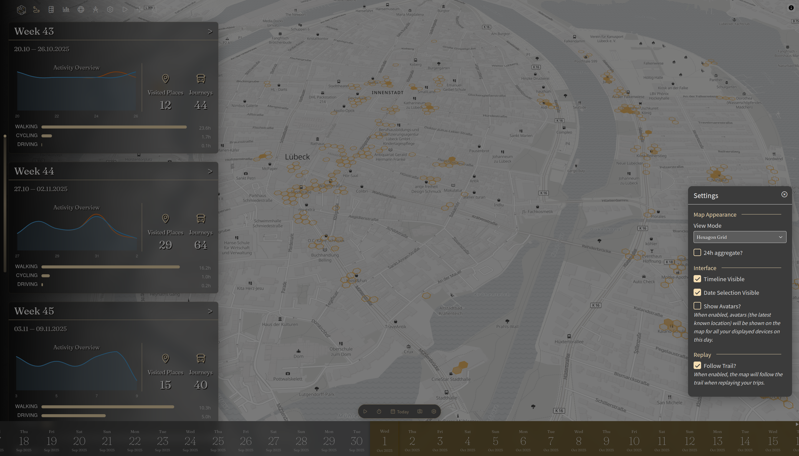
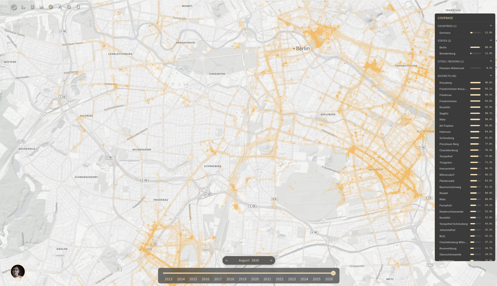
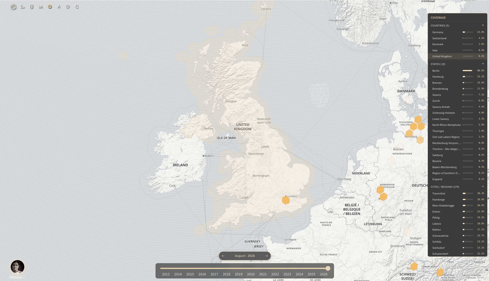

|since|v5.2.0|.version-badge|

H3 Spatial Coverage gives you a bird's-eye view of your exploration history. Instead of just seeing where you've been as individual tracks on a map, it visualizes the percentage of an area you've actually covered — whether that's a city, a district, or an entire country.

### Why Use Spatial Coverage?

Spatial coverage turns your raw location data into a clear picture of your exploration footprint:

- **Percent-Based Insights**: See exactly how much of an area you have uncovered (e.g., "You've explored 42 % of Berlin")
- **Time Travel**: Go back in time and see what your coverage looked like months or years ago. Watch your exploration grow
- **Compare Areas**: Switch between cities, districts, or countries to see where you've spent the most time
- **Discover Hidden Gaps**: Find neighborhoods or regions you haven't visited yet

### How It Works

Reitti uses Uber's [H3](https://www.uber.com/blog/h3/) hexagon grid system to discretize geographic space into evenly sized cells. Here is the process:

1. **Enable the feature** (see Configuration below).
2. **Background calculation** begins: Reitti assigns an H3 hex cell to every location point in your database.
3. **Global boundary database** is downloaded from Cloudflare. Provided by [Paikka](https://github.com/dedicatedcode/paikka), it maps H3 cells to administrative boundaries (countries, states, cities, districts) using OpenStreetMap data. The download is roughly **4 GB** and requires around **5 GB** of disk space once extracted.
4. **Coverage calculation** compares the number of unique hex cells you've visited against the total number of cells in any given boundary, this gives you your coverage percentage.
5. **Historical snapshots** are preserved, letting you navigate backward in time to see how your coverage evolved.

### Configuration

Spatial coverage is disabled by default. Enable it using one of the following methods:

#### Docker

Set the environment variable to `true`:

```yaml
environment:
  - SPATIAL_COVERAGE=true
```

#### JAR / application.properties

Add the following to your `application.properties`:

```properties
reitti.h3.enabled=true
```

### Restart

A restart is required after enabling the feature. When Reitti starts back up, it will:

- Download the global administrative boundary index
- Begin calculating H3 cells for every point in the database in the background

**Please be patient** — depending on the size of your database, the initial calculation can take a considerable amount of time and will use additional disk space.

### Main Map Layer

Enabling spatial coverage also adds a new H3 overlay to Reitti's main map. Each visited hex cell appears as a colored tile, giving you an at-a-glance view of your coverage directly from the main map.



### Using the Coverage Page

Once the initial calculation is complete, navigate to the **Spatial Coverage** page. The page shows a map with all your visited H3 cells overlaid.



#### Right Panel — Area Explorer

On the right side of the map, a panel lists all OSM administrative areas you have visited, grouped by level:

- **Country**
- **City**
- **District**
- **Other**

The list updates automatically as you zoom and pan the map — it only shows areas that fall within the currently visible map boundaries.

- **Hover** over an area to see its boundary outline on the map.
- **Click** an area to zoom the map to its full extent and display the H3 cells at the exact resolution used to calculate your coverage percentage.
- **Click again** to deselect and return to the default view.



#### Controls

At the **bottom right**, you can switch between different devices and connected users to view each one's coverage individually.

At the **bottom**, a **time slider** lets you travel backward in time — see what your coverage looked like a week, a month, or years ago.

### Disabling the Feature

If you decide you no longer want spatial coverage:

1. Set `SPATIAL_COVERAGE` to `false` (or remove the environment variable entirely).
2. Restart Reitti.
3. Reitti will **automatically clean up** all H3 cells and the downloaded boundary database in the background.

You do not need to manually delete anything.

### Best Practices

- **Be patient with initial processing**: The first calculation processes every point in your database. Let it run — it works in the background and will not affect normal usage.
- **Ensure sufficient disk space**: The H3 cells and the global boundary database add to your storage footprint.
- **Use the time slider**: The historical view is one of the most powerful aspects of this feature — experiment with different dates to see how your exploration has changed over time.