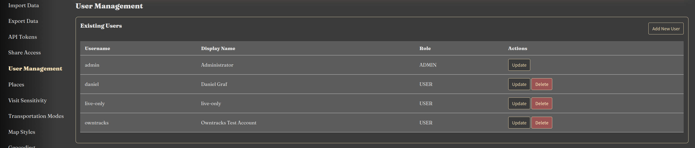

Reitti provides a **User Management** page that lets administrators manage all accounts on the instance, while giving
every user a place to edit their own profile and preferences. A single page at **Settings > User Management** renders
two
completely different views depending on your role:

- **Admin users** see a table of all accounts with create, edit, and delete actions.
- **Non-admin users** (and admins editing their own account) see their own profile form.

### Roles and User Types

Reitti distinguishes between the **role** of a user (what they are allowed to do) and the **user type** (how their
location data is handled).

| Role           | Description                                                                     |
|----------------|---------------------------------------------------------------------------------|
| **Admin**      | Full access to all settings, including the ability to manage every user account |
| **User**       | A regular account that can edit its own profile and preferences                 |
| **API Access** | An account intended for programmatic API access                                 |

| User Type          | Description                                                                                          |
|--------------------|------------------------------------------------------------------------------------------------------|
| **Normal**         | Retains the full location history, visits, places, and memories                                      |
| **Live Data Only** | Only tracks live location data and retains **no history** (visits, places, and memories are deleted) |

### Admin User List

Administrators are shown a table of all users with the following columns and actions:

- **Username** — the login name of the account
- **Display Name** — the name shown across the interface
- **Role** — the account's role (`Admin`, `User`, or `API Access`)
- **Actions** — per-row **Edit** and **Delete** buttons

From this view an admin can:

- **Add New User** — opens a blank profile form to create an account. This button is hidden when local login
  is disabled (see [Configuration](#configuration)).
- **Edit** — opens the profile form for an existing user.
- **Delete** — removes an account after a confirmation prompt. You cannot delete your own account.

Feedback such as success or error messages is shown at the top of the list. If an admin changes their own username, a
special banner prompts them to re-login.

### Profile Form

The profile form is shared between administrators editing any account and users editing their own profile. It contains
the following sections:

#### Identity

- **Username** — required
- **Display name** — required
- **Password** — required when creating a user; on update, leave empty to keep the current password

#### Role and User Type (admin only)

- **Role** — `User` or `Admin`
- **User Type** — `Normal` or `Live Data Only` (see [Switching User Type](#switching-user-type))

#### Profile Picture

- Choose one of four bundled default avatars
- Upload a custom image (up to 2 MB; JPEG, PNG, GIF, or WebP)
- Remove the current avatar

#### Custom CSS

Upload your own stylesheet (up to 1 MB, must be a `.css` file) to personalize the interface, or remove an existing one.

#### Preferences

- **Preferred Language** — one of the supported languages
- **Unit System** — `Metric` or `Imperial`
- **Time Display Mode** — use the browser/override timezone (`Default`) or the timezone of the current location
  (`Geo Local`)
- **Time Format** — 12-hour or 24-hour clock
- **Timezone Override** — a specific timezone, or empty to use the browser timezone
- **Color Theme** — a preset color or a custom value
- **Home Location** — latitude/longitude with an interactive map and draggable marker

### Creating a User

Creating a user (admin only) requires a username, display name, and password. Reitti then automatically provisions a
complete set of defaults for the new account:

- Personal settings (language, unit system, home location, time modes, color)
- A default map style
- A default device and API token
- Default visit and transport detection parameters (skipped for `Live Data Only` accounts)

### Updating a User

An admin can edit any account, while a regular user can only edit their own. When updating:

- Blank username and display name fall back to the existing values
- The password is only changed when a new one is provided
- The selected language, unit system, home location, timezone, time modes, color, avatar, and custom CSS are applied
- If a user changes their own username, they are asked to re-login

Updates use optimistic locking, so if two people edit the same account at once, the later save fails with a conflict
instead of silently overwriting the earlier change.

### Switching User Type

When an admin changes an account between `Normal` and `Live Data Only`, Reitti performs the necessary data migrations:

- **Normal → Live Data Only**: requires typing the exact username in a confirmation modal, then permanently deletes all
  history (visits, trips, places, and memories).
- **Live Data Only → Normal**: recreates the default detection parameters for the account.

Without confirming the modal, a `Normal → Live Data Only` change is ignored and the account stays `Normal`.

### Deleting a User

Deleting a user (admin only, never your own account) permanently removes the account and cascades to all associated
data, including detection parameters, settings, geocoding responses, visits, places, raw location points, API tokens,
MQTT integrations, map styles, devices, and the avatar.

### OIDC-Managed Accounts

When an account is managed by an external OpenID Connect provider (see [OpenID Connect](../infrastructure/oidc.md)), the
profile form adapts:

- **Username** and **display name** inputs are disabled — they are synchronized from the provider.
- The **password** field is hidden when local login is disabled.
- The **avatar** section is replaced with a notice that the avatar is managed by the provider and updated automatically.
- An information banner shows a **"View external profile"** link to the provider's profile page.

These fields can never be overwritten by the form; they are always preserved from the provider's data. For details on
how OIDC users are created and matched, refer to the [OpenID Connect](../infrastructure/oidc.md) documentation.

### Best Practices

- **Use `Normal` for full-feature accounts**: It retains history, visits, places, and memories. Reserve `Live Data Only`
  for accounts that only need live tracking.
- **Confirm before switching to `Live Data Only`**: The transition permanently deletes all history and cannot be undone.
- **Disable local login for OIDC-only environments**: Set `local-login.disable` to enforce authentication through your
  provider and hide the password fields.
- **Never delete your own account**: Self-deletion is blocked to avoid locking yourself out of the instance.
