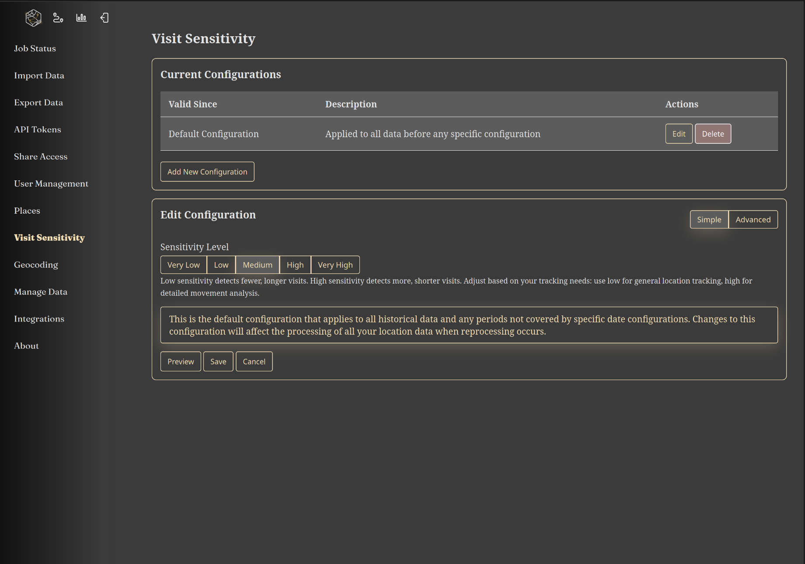
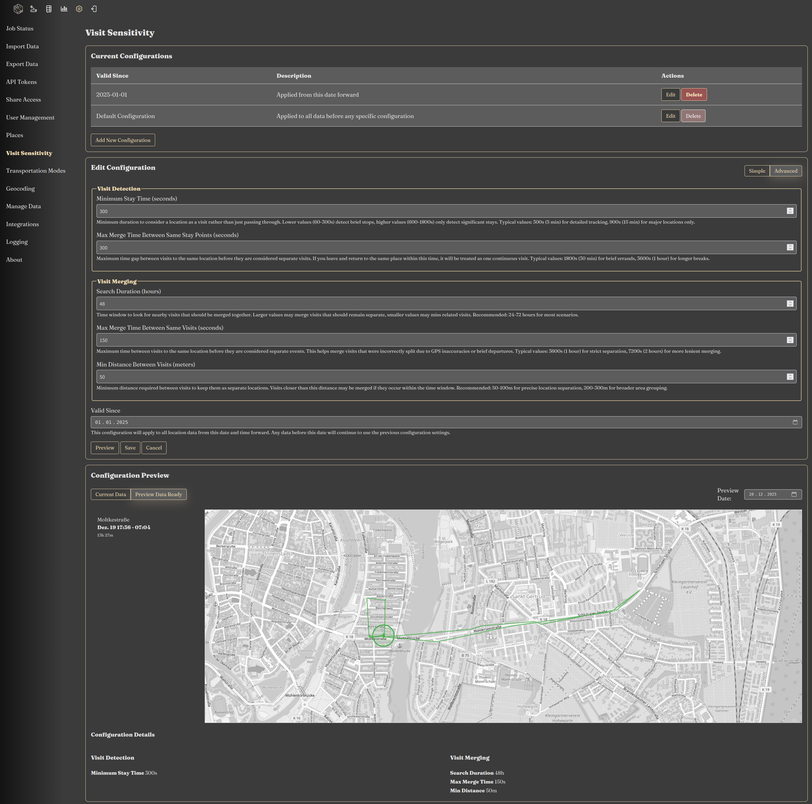

|since|v1.6.0|.version-badge|

Reitti's visit detection algorithm automatically identifies when you've stayed at a location for a significant period of time. The algorithm parameters can be customized to match your specific movement patterns and data frequency.

### Why Use Visit Detection?

Visit detection enhances your location data by:

- **Meaningful Stops**: Automatically identifies significant locations where you've spent time
- **Pattern Recognition**: Distinguishes between brief stops and actual visits
- **Data Optimization**: Reduces noise from GPS drift and brief pauses
- **Personalized Analysis**: Adapts to your unique movement patterns and lifestyle

### How It Works

1. The algorithm analyzes your location data to identify periods of minimal movement
2. Parameters like minimum duration and distance thresholds determine what constitutes a "visit"
3. Detected visits are marked, merged and can be viewed separately from your movement tracks

### Configuration

To configure visit detection:

1. Navigate to **Settings > Visit Detection**
2. Choose between **Simple Mode** or **Advanced Mode**
3. Configure your preferred settings
4. Use the preview functionality to test your configuration
5. Save your settings to apply the new parameters

### Configuration Modes

#### Simple Mode

Simple mode offers five predefined presets optimized for different use cases.

#### Advanced Mode

Advanced mode allows fine-tuning of individual parameters:

- **Minimum Duration**: How long you must stay to register a visit
- **Distance Threshold**: Maximum movement radius during a visit
- **Time Window**: Period for analyzing movement patterns
- **GPS Accuracy**: Filtering based on location precision
- **Custom Rules**: Additional criteria for specific scenarios

### Features

- **Live Preview**: See how settings affect your existing data before applying
- **Automatic Recalculation**: Reitti detects when historical data needs reprocessing and asks you if you want to start a recalculation.

### Best Practices

- **Start with Simple Mode**: Use presets before moving to advanced configuration
- **Use Preview**: Always test settings with the preview before applying
- **Consider Data Frequency**: Higher frequency data allows for finer parameter tuning

### Data Frequency Guidelines

The optimal parameters depend on how frequently location data is recorded:

- **High Frequency** (every 10 seconds): Use sensitive settings with shorter durations
- **Medium Frequency** (every 15 seconds): Balanced settings work well
- **Low Frequency** (every 30 seconds): Conservative settings prevent false detections

Once configured, visit detection will automatically process your location data to identify meaningful stops and enhance your location timeline analysis.

