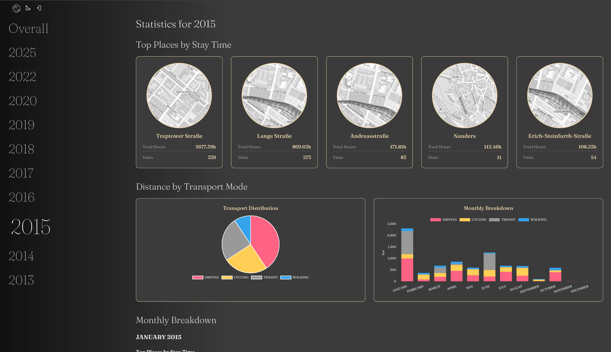

## Reitti - Personal Location Tracking

Reitti is a comprehensive personal location tracking and analysis application that helps you understand your movement patterns and significant places. The name "Reitti" comes from Finnish, meaning "route" or "path".

### Screenshots

#### Main View


#### Multiple Users View


#### Live Mode


### Statistics View


### Memories
Memories transform your raw location data into narrative-driven travel logs, allowing you to create, edit, and share personalized stories with customizable blocks like text, maps, and images.

### Key Features

#### Core Location Analysis
- **Visit Detection**: Automatically identify places where you spend time with configurable algorithms
- **Trip Analysis**: Track your movements between locations with transport mode detection (walking, cycling, driving)
- **Significant Places**: Recognize and categorize frequently visited locations with custom naming
- **Timeline View**: Interactive daily timeline showing visits and trips with duration and distance information
- **Raw Location Tracking**: Visualize your complete movement path with detailed GPS tracks
- **Multi-User-View**: Visualize all your family and friends on a single map
- **Live-Mode**: Visualize incoming data automatically without having to reload the map
- **Fullscreen-Mode**: Display the map in fullscreen. Combined with the Live-Mode you got a nice kiosk-display
- **Memories**: Create and share narrative travel logs from your location data with customizable content blocks

#### Data Import & Integration
- **Multiple Import Formats**: Support for GPX files, Google Takeout JSON, Google Timeline Exports and GeoJSON files
- **Real-time Data Ingestion**: Live location updates via OwnTracks and GPSLogger mobile apps
- **Batch Processing**: Efficient handling of large location datasets with queue-based processing
- **API Integration**: RESTful API for programmatic data access and ingestion

#### Privacy & Self-hosting
- **Complete Data Control**: Your location data never leaves your server
- **Self-hosted Solution**: Deploy on your own infrastructure
- **Asynchronous Processing**: Handle large datasets efficiently with RabbitMQ-based processing

### Quick Start

The easiest way to get started is with Docker:

```bash
# Download the docker-compose.yml file
wget https://github.com/dedicatedcode/reitti/blob/main/docker-compose.yml

# Start all services
docker-compose up -d
```

This will make Reitti available at http://localhost:8080 with default credentials **admin:admin**.

### License

Reitti is licensed under the MIT License.
