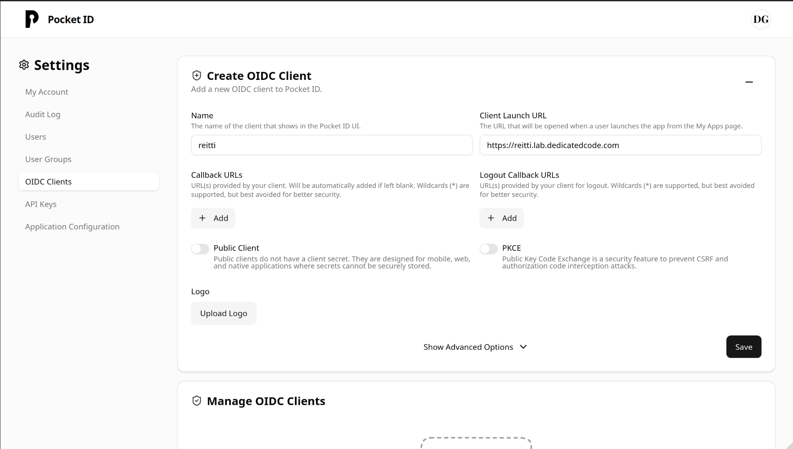
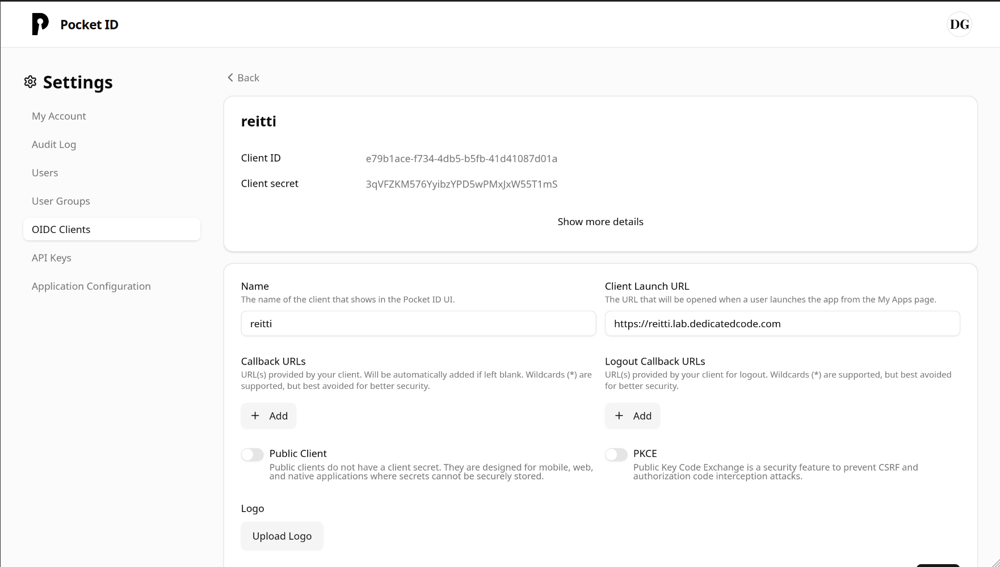

## General Information

Reitti can be configured to use an OpenID Connect (OIDC) provider for user authentication. This allows you to integrate
Reitti with existing identity management systems and leverage
features like single sign-on (SSO) and multi-factor authentication (MFA) provided by your OIDC provider.

### Configuration

#### Docker

To enable OIDC authentication when running Reitti with Docker, you need to set the following environment variables in
your **docker-compose.yml** file under the **reitti** service.

| Environment Variable     | Description                                                                                                                                     | Default Value | Example Value                             |
|:-------------------------| :---------------------------------------------------------------------------------------------------------------------------------------------- | :------------ | :---------------------------------------- |
| `OIDC_ENABLED`           | Whether to enable OIDC sign-ins                                                                                                                 | `false`       | `true`                                    |
| `OIDC_CLIENT_ID`         | Your OpenID Connect Client ID (from your provider)                                                                                              |               | `google`                                  |
| `OIDC_CLIENT_SECRET`     | Your OpenID Connect Client secret (from your provider)                                                                                          |               | `F0oxfg8b2rp5X97YPS92C2ERxof1oike`         |
| `OIDC_ISSUER_URI`        | Your OpenID Connect Provider Discovery URI (don't include the `/.well-known/openid-configuration` part of the URI)                              |               | `https://github.com/login/oauth`          |
| `OIDC_SCOPE`             | Your OpenID Connect scopes for your user (set to the values in the example if you're unsure). This variable is optional.                        | `openid,profile` | `openid,profile`                            |

Here's an example of how you might add these to your **docker-compose.yml**:

```yaml
services:                                                                                                                                                                                                                                                                           
  reitti:                                                                                                                                                                                                                                                                             
    image: dedicatedcode/reitti:latest                                                                                                                                                                                                                                                  
    environment:                                                                                                                                                                                                                                                                        
      - OIDC_ENABLED=true                                                                                                                                                                                                                                                               
      - OIDC_CLIENT_ID=your_client_id                                                                                                                                                                                                                                                   
      - OIDC_CLIENT_SECRET=your_client_secret                                                                                                                                                                                                                                           
      - OIDC_ISSUER_URI=https://your_oidc_provider.com                                                                                                                                                                                                                                
# ... other configurations                                                                                                                                                                                                                                                          
                                            
```

#### Running from source

When running Reitti directly from its source code, OIDC authentication can be enabled by placing an **oidc.properties**
file in the same directory as your **application.properties** file. This **oidc.properties** file should contain the
necessary OIDC configuration details.
```properties
reitti.security.oidc.enabled=true
spring.security.oauth2.client.registration.oauth.client-id=<client id from your provider>
spring.security.oauth2.client.registration.oauth.client-secret=<client secret from your provider>
spring.security.oauth2.client.provider.oauth.issuer-uri=<url of your provider>
spring.security.oauth2.client.registration.oauth.scope=openid,profile
```

### Additional Configuration

#### User Registration Control

By default, Reitti automatically creates new user accounts when someone logs in via OIDC for the first time. You can control this behavior with the following setting:

| Environment Variable     | Description                                                                                                                                     | Default Value | Example Value                             |                                          
|:-------------------------| :---------------------------------------------------------------------------------------------------------------------------------------------- | :------------ | :---------------------------------------- |                                          
| `OIDC_SIGN_UP_ENABLED`   | Whether to automatically create new users on first OIDC login. When disabled, only existing users can log in via OIDC.                        | `true`        | `false`                                   |                                            


#### Local Authentication Control

You can configure whether users can still use local passwords alongside OIDC authentication:

| Environment Variable     | Description                                                                                                                                     | Default Value | Example Value                             |                                          
|:-------------------------| :---------------------------------------------------------------------------------------------------------------------------------------------- | :------------ | :---------------------------------------- |                                          
| `DISABLE_LOCAL_LOGIN`    | When enabled, disables local password authentication and clears existing passwords to enforce OIDC-only login.                                 | `false`       | `true`                                    |                                           

#### User Matching and Account Linking

Reitti uses a flexible process to match OIDC users with existing accounts:

1. **Primary Match**: Searches for users by external ID (format: `{issuer}:{subject}`)
2. **Fallback Match**: If no external ID match, searches by the OIDC `preferred_username`
3. **Account Linking**: When a username match is found, the account is linked with the external ID for future logins

### Username Assignment Logic

When a user logs in via OIDC for the first time, Reitti follows this priority to determine their username:

1. **`preferred_username` claim** from the ID token
2. **`preferred_username` claim** from the OIDC user object
3. **`preferred_username` claim** from user info endpoint (if available)
4. **Email address** (`email` claim)
5. **Generated name** (`given_name` + "." + `family_name` in lowercase)
6. **OIDC subject** (`sub` claim) as final fallback

This means Reitti will try multiple OIDC claims before falling back to the subject identifier. For example:

- If your OIDC provider supplies `preferred_username: "jane.doe"`, that becomes the username
- If not, but `email: "jane@example.com"` is available, that becomes the username
- If only `given_name: "Jane"` and `family_name: "Doe"` are available, the username becomes `"jane.doe"`
- As a last resort, the OIDC subject (e.g., `"1234567890"`) is used

#### User Data Synchronization

User information is automatically updated from OIDC claims on each login:

- **Username**: Set from the `preferred_username` claim
- **Display Name**: Updated from the `name` claim
- **Profile URL**: Updated from the `profile` claim (if available)
- **Avatar**: Automatically downloaded from the `picture` claim (if provided)

#### Required OIDC Claims

Your OIDC provider must provide these claims for successful authentication:

- `sub` (subject) - **Required** for external ID generation
- `preferred_username` - **Required** for username assignment
- `name` - **Recommended** for display name
- `profile` - **Optional** for profile URL
- `picture` - **Optional** for avatar download

#### Security Notes

- External IDs are immutable once set, ensuring account security even if usernames change in the OIDC provider
- User data is refreshed on each login to keep information current
- Avatar downloads are performed securely with proper error handling

### Provider Examples
This section provides examples of how to configure Reitti with different OpenID Connect providers.

#### PocketId
PocketId is a self-hosted OpenID Connect provider. You can find more information about the project [here](https://github.com/pfortin/pocketid).

To configure Reitti to use PocketId:

**Create a new client in PocketId**:

   * Log in to your PocketId instance.
   * Navigate to the client registration section.
   * Create a new client, providing a name for your Reitti installation (e.g., "Reitti App").
   * Crucially, set the URI to the URL of your Reitti installation.
   * If you want to be logged out of Reitti when you log out in PocketId, make sure to set the **Logout Callback Url** to **https://<your-reitti-url>/logout/connect/back-channel/oauth**



**Obtain Client ID and Client Secret**:

After creating the client, PocketId will display a **Client ID** and a **Client Secret**. Copy these values.



**Configure Reitti**:
  
  * **For Docker**: Set the **OIDC_CLIENT_ID** and **OIDC_CLIENT_SECRET** environment variables in your **docker-compose.yml** file to the values you copied from PocketId.
  *   **For Running from Source**: Enter the **Client ID** and **Client Secret** into the **oidc.properties** file for **spring.security.oauth2.client.registration.oauth.client-id** and **spring.security.oauth2.client.registration.oauth.client-secret** respectively.
  *   The **OIDC_ISSUER_URI** (for Docker) or **spring.security.oauth2.client.provider.oauth.issuer-uri** (for **oidc.properties**) should be set to the base URL of your PocketId installation (e.g., https://your-pocketid-domain.com).

#### Authelia

Authelia is an open-source authentication server that provides single sign-on (SSO) and two-factor authentication. For integrating Reitti with Authelia using OpenID Connect (OIDC), follow these steps:

**Generate Client Secret**

Run the following command to generate a secure client secret. **You must save this value as it cannot be recovered**:

```bash
docker run authelia/authelia:latest authelia crypto hash generate pbkdf2 \
  --variant sha512 \
  --random \
  --random.length 72 \
  --random.charset rfc3986
```

**Configure Authelia**

Add the following OIDC client configuration to your Authelia `config.yml` under `identity_providers:oidc:clients`, replacing these values:
- `<CLIENT-SECRET-DIGEST>` with the hash from step 1
- Redirect URIs with your Reitti's actual URLs

```yaml
- client_id: 'reitti'
  client_name: 'Reitti'
  client_secret: '<CLIENT-SECRET-DIGEST>'
  public: false
  scopes:
    - 'openid'
    - 'profile'
  authorization_policy: one_factor
  consent_mode: pre-configured
  token_endpoint_auth_method: "client_secret_basic"
  pre_configured_consent_duration: 1w
  redirect_uris:
    - https://<your reitti domain>/login/oauth2/code/oauth
    - https://<your reitti domain>/login
  grant_types:
    - refresh_token
    - authorization_code
  response_types:
    - code
  response_modes:
    - form_post
    - query
    - fragment
```

**Configure Reitti**

**For Docker Deployment:**
Add these environment variables in your `docker-compose.yml` file:
- `OIDC_CLIENT_ID`: Use the client ID ("reitti" as shown above)
- `OIDC_CLIENT_SECRET`: Use the original secret value (before hashing)
- `OIDC_ISSUER_URI`: Your Authelia base URL (e.g., `https://auth.yourdomain.com`)

**For Source Deployment:**
Configure these properties in `oidc.properties`:
```properties
spring.security.oauth2.client.registration.oauth.client-id=reitti
spring.security.oauth2.client.registration.oauth.client-secret=<original-secret>
spring.security.oauth2.client.provider.oauth.issuer-uri=https://auth.yourdomain.com
```

After making these changes, restart both Authelia and Reitti for the configuration to take effect.

If you need more information, here is a good tutorial for setting up Immich, the basics are the same for Reitti. [blog.lrvt.de/configuring-authelia-oidc-for-immich/](https://blog.lrvt.de/configuring-authelia-oidc-for-immich/)

#### Google

Google can be used as an OpenID Connect provider for Reitti. Because Google does **not** provide the `preferred_username` claim, you must request the `email` scope in addition to `openid` and `profile`. The email address will be used as the username fallback.

**Steps to obtain the required information**

1. **Create a Google Cloud project** (or use an existing one) in the [Google Cloud Console](https://console.cloud.google.com/).
2. **Enable the “Google Identity Services” API** for the project if it is not already enabled.
3. **Configure OAuth consent screen**  
   * Choose **External** or **Internal** depending on your organization.  
   * Fill in the required fields (application name, support email, etc.).  
4. **Create OAuth 2.0 credentials**  
   * Go to **APIs & Services → Credentials**.  
   * Click **Create Credentials → OAuth client ID**.  
   * Select **Web application**.  
   * Set **Authorized redirect URIs** to the Reitti callback URL, e.g.:  
     `https://<your-reitti-domain>/login/oauth2/code/oauth`.  
   * After creation, note the **Client ID** and **Client secret**.

**Configuration**

*For Docker* – add the following environment variables to your `docker-compose.yml`:

```yaml
environment:
  - OIDC_ENABLED=true
  - OIDC_CLIENT_ID=<your-google-client-id>
  - OIDC_CLIENT_SECRET=<your-google-client-secret>
  - OIDC_ISSUER_URI=https://accounts.google.com
  - OIDC_SCOPE=openid,profile,email
```

*For source deployment* – add the corresponding entries to `oidc.properties` (replace placeholders with your values):

```properties
spring.security.oauth2.client.registration.oauth.client-id=<your-google-client-id>
spring.security.oauth2.client.registration.oauth.client-secret=<your-google-client-secret>
spring.security.oauth2.client.provider.oauth.issuer-uri=https://accounts.google.com
spring.security.oauth2.client.registration.oauth.scope=openid,profile,email
```

**Important note:** Because Google does not supply `preferred_username`, Reitti will fall back to the `email` claim for the username. Ensure that the `email` scope is requested; otherwise login will fail.

With these settings in place, restart Reitti (and the Docker container if applicable) and you should be able to log in using Google accounts.

