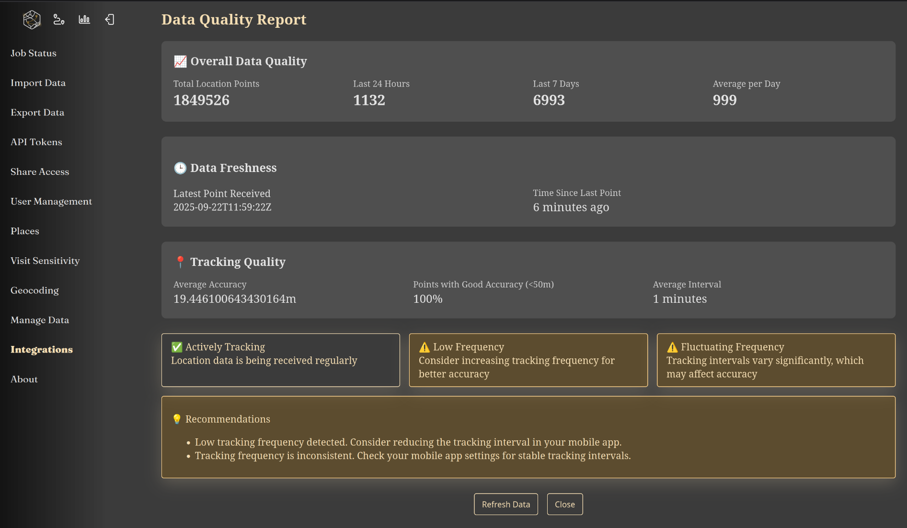

Reitti supports real-time location tracking through popular mobile applications, allowing you to continuously stream your location data for automatic processing and analysis.

### Supported Mobile Apps

**OwnTracks** - A privacy-focused location tracking app available for iOS and Android that publishes your location to your own server. [Download from Play Store](https://play.google.com/store/apps/details?id=org.owntracks.android) | [Download from App Store](https://itunes.apple.com/us/app/mqttitude/id692424691?mt=8)

**GPSLogger** - A lightweight GPS logging application that can send location data to various endpoints including HTTP servers. [Download from F-Droid](https://f-droid.org/de/packages/com.mendhak.gpslogger/) | [Download from GitHub](https://github.com/mendhak/gpslogger) | Install via [Obtainium](https://obtainium.imranr.dev/) and add the link to the [GitHub release](https://github.com/mendhak/gpslogger/releases) page.

**Overland** - A GPS logger specifically designed for iOS devices that sends location data in GeoJSON format. [Visit Homepage](https://overland.p3k.app/) | [Download from App Store](https://apps.apple.com/app/overland-gps-tracker/id1292426766)

### Recommendation

We recommend using **GPSLogger** for the following reasons:

- **Flexible Frequency Settings**: Tracking frequency can be set independently of the upload frequency, allowing you to capture high-resolution location data while controlling network usage
- **Built-in Backup**: GPSLogger automatically stores GPX files for every tracked day directly on your device, providing a reliable local backup of your location history

### Tracking Frequency Requirements

Since Reitti 3.0, the system can interpolate location points that fall within a small spatial radius even if there are time gaps between them. This allows Reitti to achieve its target points‑per‑minute frequency internally, so you no longer need to enforce a strict tracking interval on the mobile app. Sparse data sources such as Significant‑Change Mode or other low‑frequency logging can be used successfully.

Reitti will automatically generate intermediate points to reach the configured **desired points per minute** (default X). You should still aim for a reasonable tracking interval (e.g., 30‑60 seconds) to improve raw data quality, but the system can handle larger gaps (up to several hours) without degrading visit detection.

Benefits of the new approach:

- **Flexibility**: Works with both high‑frequency continuous tracking and low‑frequency significant‑change updates.
- **Battery Efficiency**: Allows you to use power‑saving modes without sacrificing analysis quality.
- **Accuracy**: Interpolation is performed only when points are within a configurable radius, preserving spatial precision.

Both OwnTracks and GPSLogger can be configured to send data at any interval; GPSLogger’s independent tracking and upload settings still make it convenient for fine‑tuning.

### Configuration Steps

1. Navigate to **Settings > Integrations** in your Reitti web interface  
2. In the **Mobile App Integration** section, you'll find:
   - **OwnTracks Configuration**: Settings and authentication details  
   - **GPSLogger Configuration**: HTTP endpoint URLs and API tokens  
   - **Overland Configuration**: Endpoint URL and optional device identifier  

For each supported app, a **Remote Configuration** button is provided on this page. Press the button on the mobile device where the app is installed to apply the settings automatically.

### OwnTracks Setup

1. Install OwnTracks from your device's app store
2. Configure the app with the details from the Reitti settings
3. **Important**: Increase tracking frequency by going to **Settings > Advanced > Location interval** and changing from 60 to 30 seconds for better accuracy
4. Start tracking and your location data will automatically flow into Reitti

### GPSLogger Setup

1. Install GPSLogger on your mobile device
2. Configure the HTTP endpoint URL provided in Reitti's integration settings
3. Set up authentication using the API token from your Reitti user settings
4. Configure logging intervals and accuracy preferences. Go to `Performance` and set:
   1. `Logging interval` to `30`
   2. `Distance filter` to `0`
   3. `Accuracy Filter` to `40`
5. Start logging to begin sending data to Reitti

### Overland Setup 
|since|v2.3.0|.version-badge|

1. Install Overland from the App Store
2. Open Overland and go to the **Settings** tab
3. **Important**: Tap the **Request Permission** button to grant location access, Overland will not track anything without this permission
4. Tap on **Receiver Endpoint**
5. Set the **Endpoint URL** to the URL provided in your Reitti integration settings
6. Leave the **Device ID** field empty or set a custom identifier
7. Leave the **Access Token** field empty (we use the token in the URL)
8. Configure tracking settings:
   - **Desired Accuracy**: Best (for high accuracy) or 100m (for battery saving)
   - **Points per Batch**: 50-200 (lower for unreliable connections)
   - **Significant Location**: Disabled for continuous tracking
9. Go to the **Tracker** tab and turn tracking **On**
10. Adjust the sending interval slider (1 second to 30 minutes)
11. The app will start sending location data automatically

### Data Quality Dashboard

|since|v1.6.0|.version-badge|

Reitti provides a comprehensive data quality dashboard accessible through the "View Data Quality" button in your user interface. This dashboard is most useful after Reitti has received at least a day of continuous location data from your mobile device.

The dashboard displays the following metrics to help you monitor and optimize your location tracking:

- **Total Location Points**: The total number of location data points known for your user account
- **Last 24 Hours**: Number of location points received in the last 24 hours
- **Last 7 Days**: Number of location points received in the last 7 days
- **Average per Day**: The average number of location points ingested per day over the last 7 days
- **Latest Point Received**: Timestamp of the most recently received location data
- **Time Since Last Point**: How long ago the last location point was received
- **Average Accuracy**: The average GPS accuracy of incoming data points (measured in meters)
- **Points with Good Accuracy (<50m)**: Percentage of location points with GPS accuracy better than 50 meters
- **Average Interval**: The average time interval between location points in the last 24 hours

Reitti incorporates intelligent measures to accommodate low-frequency tracking during nighttime hours or when your phone enters power-saving mode, ensuring reliable location data collection even with varying tracking intervals.

### Benefits

- **Real-time Updates**: See your location data appear on the map as you move
- **Automatic Processing**: Location data is automatically processed into visits and trips
- **Battery Optimization**: Both apps are designed for efficient battery usage
- **Privacy Focused**: Your data goes directly to your own server
