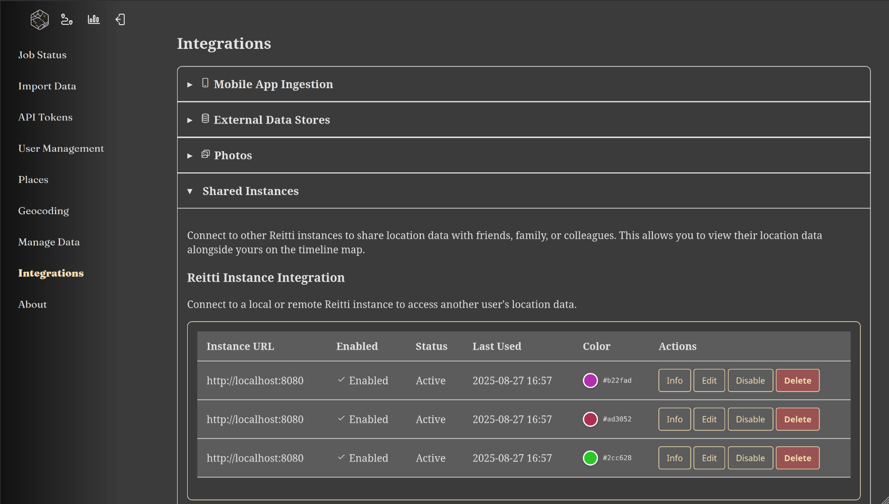
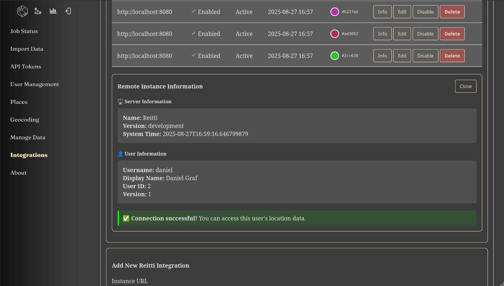

|since|v1.3.0|.version-badge|

The **Shared Instances** feature lets you link up with users on other Reitti servers, creating a network where you can share location information across different setups. This keeps things private and under your control while allowing collaboration.

### Overview

Shared Instances is an improved way to connect with others, replacing the old "Connected Accounts" system. Instead of only linking with people on the same server, you can now:

- Connect with users on distant Reitti servers
- Share location details between different servers
- Keep user accounts separate while working together
- Track how API tokens are used for better security

### Key Features

#### Connecting Across Instances

You can link with users on other Reitti servers through a simple menu in **Settings > Integrations > Shared Instances**. This creates a connected network for sharing location data across various Reitti installations.

#### Easy Setup

Getting connected is simple:
1. Type in the web address of the other server
2. Add the API token from the user you want to connect with
3. Test the link to make sure it works
4. Begin sharing location information

### Setting Up Shared Instances

#### What You Need First

- Reitti version 1.3.0 or newer on both servers
- The servers need to be able to talk to each other over the internet
- Valid API tokens from the users on the other server

#### Steps to Set It Up

1. **Go to Settings**
   - Head to **Settings > Integrations > Shared Instances**

2. **Add a New Shared Instance**
   - Click "Add Shared Instance"
   - Enter the web address of the other server (like **https://reitti.example.com**). You can even connect to the local instance by using **http://localhost:8080**.
   - Provide the API token from the user on that server

3. **Test the Connection**
   - Use the built-in test to check if everything is set up right
   - Make sure the other server is reachable and the API token is correct

4. **Check and Save**
   - Finish the verification steps
   - Save the setup to create the link

### User Interface

#### Shared Instances Overview

*The new Shared Instances integration overview*

#### Remote User Information

*Detailed information modal for remote users*

### Security Considerations

#### Managing API Tokens
- API tokens give access to location data, so handle them carefully
- Check and change them regularly if needed
- Keep an eye on how they're being used through the tracking tools
- Cancel them right away if you think they've been compromised

#### Network Security
- Always use secure connections (HTTPS) for linking servers
- Set up firewalls properly
- Think about using a VPN for extra protection in sensitive cases
- Make sure the security certificates on remote servers are valid

#### Data Privacy
- The information you share follows the rules of both servers
- You decide what data to share
- You can stop the connection anytime
- Sharing works both ways by default

### Troubleshooting

#### Common Problems

**Connection Won't Work**
- Double-check the web address of the other server is right, and you can reach it
- Make sure the API token is valid and hasn't expired
- Ensure the servers can communicate over the network
- Confirm the other server is version 1.3.0 or later

**Login Issues**
- Create a new API token on the other server
- Verify the token has the right permissions
- Look out for any unusual characters in the token

**Data Not Updating**
- Make sure both servers are online and reachable
- Check the logs for any errors with the API token
- Ensure the other user has location data to share
- Review network connections and firewall rules

#### Getting Help and Fixing Issues

For more help:
- Look at the [Reitti GitHub repository](https://github.com/dedicatedcode/reitti) for known problems
- Check server logs for more details on errors
- Use the connection test to figure out what's wrong
- Join community talks to get advice from other users

### Best Practices

#### For Administrators
- Regularly check how API tokens are being used
- Have good backup plans for shared data
- Watch network activity and speed
- Update servers to the newest version

#### For Users
- Regularly look over your connected servers
- Think about what sharing your data means
