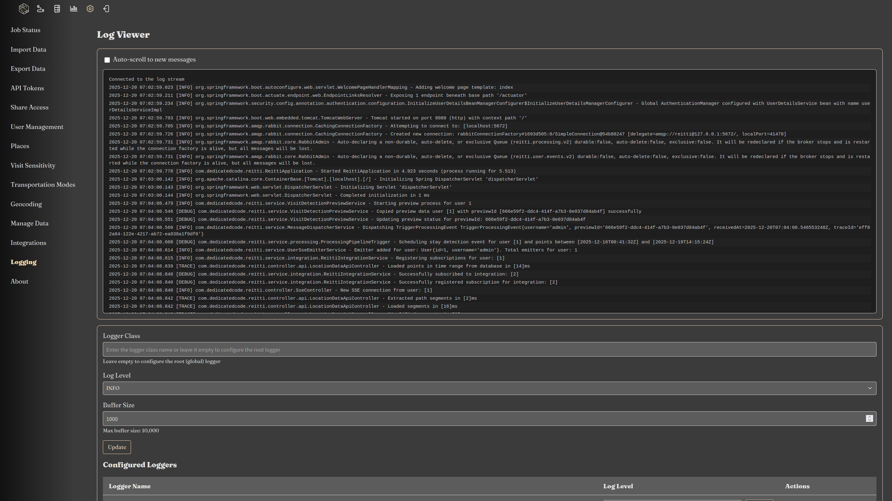

|since|v3.0.0|.version-badge|

Reitti provides an integrated logging interface for administrators.  
From **Settings > Logging** you can view a live stream of the current instance’s log output, adjust the log level of any configured logger, and add new loggers on‑the‑fly.

### Accessing the Live Log

1. Open the Reitti web UI and navigate to **Settings > Logging**.  
2. The page shows a continuously updating view of the log output from the running instance.  

### Adjusting Log Levels

Each logger that is part of the Reitti configuration appears in a table with the following columns:

| Logger name | Log Level  | Actions                |
|-------------|------------|------------------------|
| `com.dedicatedcode.reitti` |  dropdown (TRACE, DEBUG, INFO, WARN, ERROR)        | **Update**, **Delete** |
| … | …          | …                      |

* To change a logger’s level, select the desired level from the dropdown and click **Update**.  
* The new level takes effect immediately without restarting the application.
* All changes are reverted on application restart.

### Adding a New Logger

1. Fill in the **Logger name** (e.g. `com.dedicatedcode.reitti`) and choose an initial log level.  
2. Press **Update**. The logger will be registered with the underlying logging framework and start emitting messages.

### Common Use Cases

#### Inspecting the Ingestion Pipeline

When troubleshooting or fine‑tuning the location‑processing pipeline, you often need to see exactly what Reitti is calculating at each step.  
Add the following logger `com.dedicatedcode.reitti.service.processing.UnifiedLocationProcessingService` with **TRACE** level:

