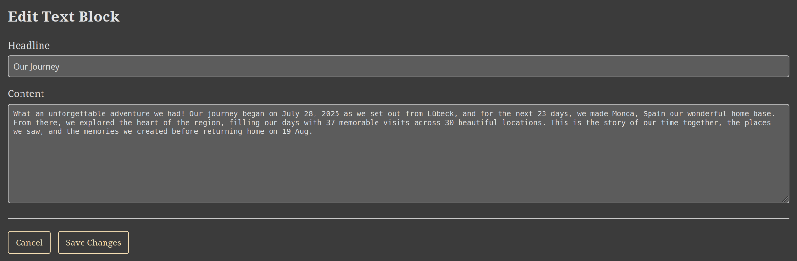
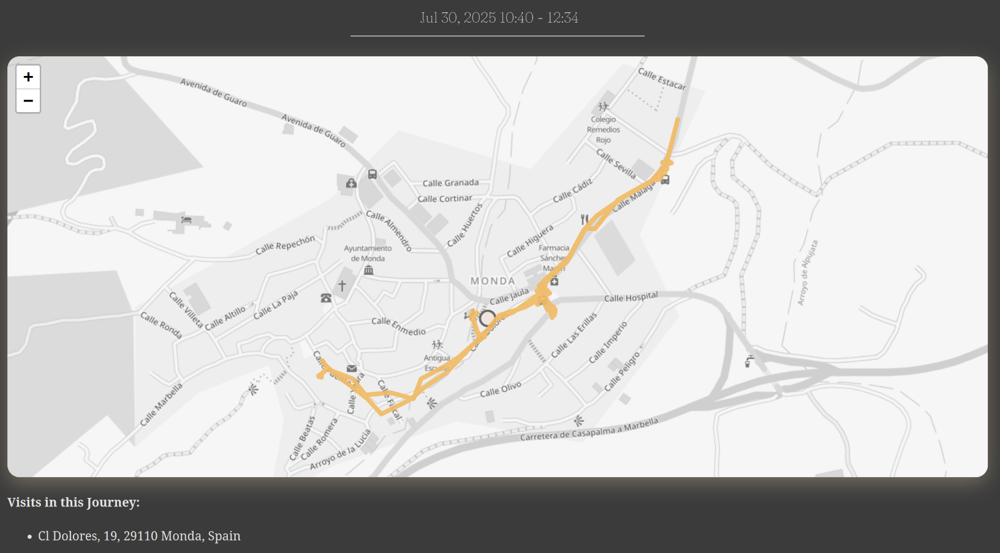
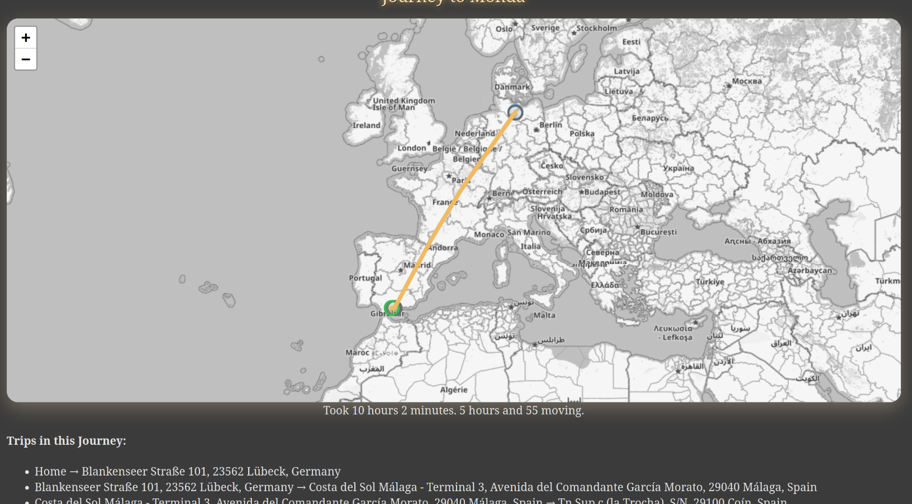
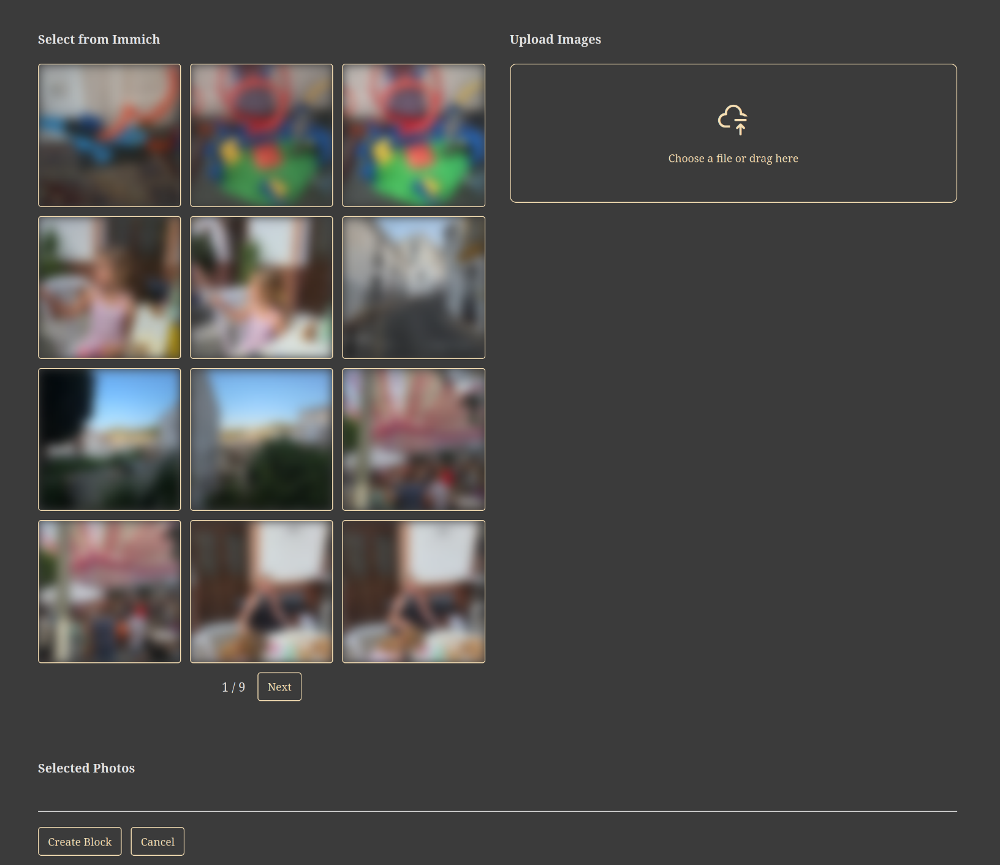

|since|v2.0.0|.version-badge|

## Edit a Memory

Editing a Memory in Reitti allows you to customize and refine your travel logs to better reflect your experiences. You can modify content, add new elements, or remove unwanted parts. To edit a Memory, you must either be the owner or have been granted access via a [magic link with edit rights](sharing.md).

### Understanding Memory Structure
A Memory is composed of **blocks**, which are modular components that make up the content. Each block represents a different type of information, such as text, maps, or images. This block-based structure makes editing flexible and intuitive.

### Steps to Edit a Memory
Follow these steps to make changes to an existing Memory:

1. **Access the Memory**: Open the Reitti website and navigate to the Memories section. Select the Memory you want to edit from your list.

2. **Enter Edit Mode**: Once inside the Memory, you'll see an editing interface. Hover over any block to reveal editing options.

3. **Edit or Remove a Block**:
   - To edit a block, hover over it and click the edit button (represented by a pencil icon). This allows you to modify the block's content directly.
   - To remove a block, hover over it and click the delete button (represented by a trash icon). Confirm the deletion if prompted. Note that removed blocks cannot be recovered, so proceed with caution.

4. **Add a New Block**:
   - After any existing block, hover to reveal an "Add Block After" button.
   - Click this button to insert a new block. You'll be prompted to select a block type from the available options (see below for details on each type).
   - Choose the type that best fits the content you want to add, then fill in the required details.

### Block Types
Reitti supports four types of blocks, each designed for specific content. When adding or editing a block, select the appropriate type:

#### **Text Block**
- **Purpose**: Add narrative or descriptive text to your Memory, such as personal reflections, notes, or summaries.
- **Components**:
  - **Headline** (Optional): A short title for the block, e.g., "Highlights of the Day".
  - **Block Text**: The main body of text. Use this to write freely about your experiences.
    
  
    
#### **Visit Block**
- **Purpose**: Showcase specific locations or stops from your journey, displayed visually on a map.
- **Components**:
  - **Title**: A descriptive name for the block, e.g., "Key Stops in Paris".
  - **Visits Selection**: Choose multiple visits from your data. These are displayed on a map with connecting paths to illustrate your route.
- **Important Note**: Visits are copied into the Memory and unlinked from the underlying data. This ensures that changes to your original location data (e.g., deletions or updates) do not affect the Memory, preserving its integrity for sharing and archiving.
  
  

#### **Trip Block**
- **Purpose**: Highlight entire trips or segments of travel, providing a broader view of your movements.
- **Components**:
  - **Title**: A name for the block, e.g., "Cross-Country Road Trip".
  - **Trips Selection**: Select multiple trips that occurred during the Memory's time period. These are visualized on a map.
- **Important Note**: Like visits, trips are copied into the Memory and unlinked from the underlying data. This protects the Memory from external data changes, ensuring it remains a stable snapshot of your travels.
  

#### **Image Gallery Block**
  - **Purpose**: Include photos to make your Memory more visual and engaging.
  - **Components**:
    - **Image Selection**: Choose images in one of two ways:
      - If Immich integration is configured (see [Photo Integration](../configurations/photo-integration.md) for setup instructions), select from your Immich library.
      - Alternatively, upload new images directly.
    - Images are displayed in a gallery format within the block.
  - **Important Note**: Images are copied into the Memory to allow sharing without exposing access to your external integrations (e.g., Immich). This ensures privacy when sharing Memories with others.

### Deleting a Memory
If you want to remove an entire Memory and all its associated data:
- Hover over the top map header of the Memory.
- In the main action bar that appears, click the "Delete" button.
- Confirm the deletion. This action is permanent and cannot be undone.

### Recalculating a Memory
If you've made significant changes to your underlying location data and want to refresh the Memory:
- Use the "Recalculate" button (found in the action bar).
- This clears the current Memory content and refills it based on your current data. It's useful for starting over.

By following these steps, you can fully customize your Memories to create personalized, shareable travel stories. If you encounter any issues or need further assistance, reach out to me on [GitHub](https://github.com/dedicatedcode/reitti).
