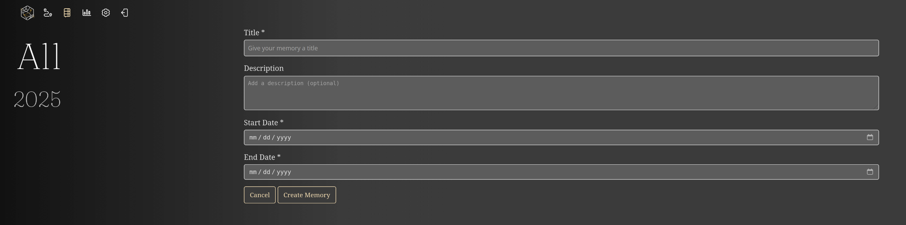

|since|v2.0.0|.version-badge|

## Create a New Memory

Creating a Memory in Reitti is a straightforward process that turns your location data into a personalized travel log. Follow these steps to get started. Note that the process relies on your existing tracked data, so ensure you have sufficient location history for the desired time period.

### Step 1: Navigate to the Memories Section
- Open the Reitti app or website.
- In the main navigation bar, click on "Memories" to access the Memories dashboard. This is where you'll manage all your existing Memories and initiate new ones.

### Step 2: Start the Creation Process
- On the Memories page, look for and click the "Create Memory" button. This will open a form where you'll input the details for your new Memory.

### Step 3: Fill in the Form
- **Title**: Enter a descriptive title for your Memory (e.g., "Summer Road Trip 2023"). This helps you identify it later.
- **Description** (Optional): Add any additional notes or context, such as key highlights or personal reflections. This field is flexible and can be left blank if preferred.
- **Start and End Dates**: Select the date range for the Memory. This defines the period from which Reitti will pull your location data. Choose dates that cover the trip or event you want to document—accuracy here ensures the Memory captures the right moments.

### Step 4: Submit and Wait for Processing
- After filling in the form, submit it. Reitti will then collect all relevant geopoints from your data within the specified date range and attempt to generate the Memory.
- **Processing Time**: This step can take a while, depending on the volume of data involved. For example, if there are many images to copy and associate with the geopoints.

Once complete, your new Memory will appear in the Memories list, ready for viewing, editing, or sharing. If you encounter issues (e.g., insufficient data), check your location tracking settings or reach out via [GitHub](https://github.com/dedicatedcode/reitti).

