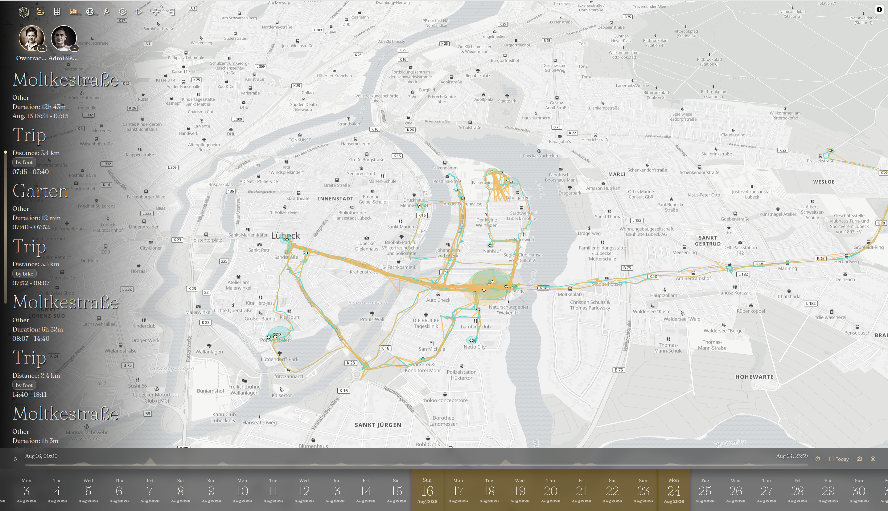
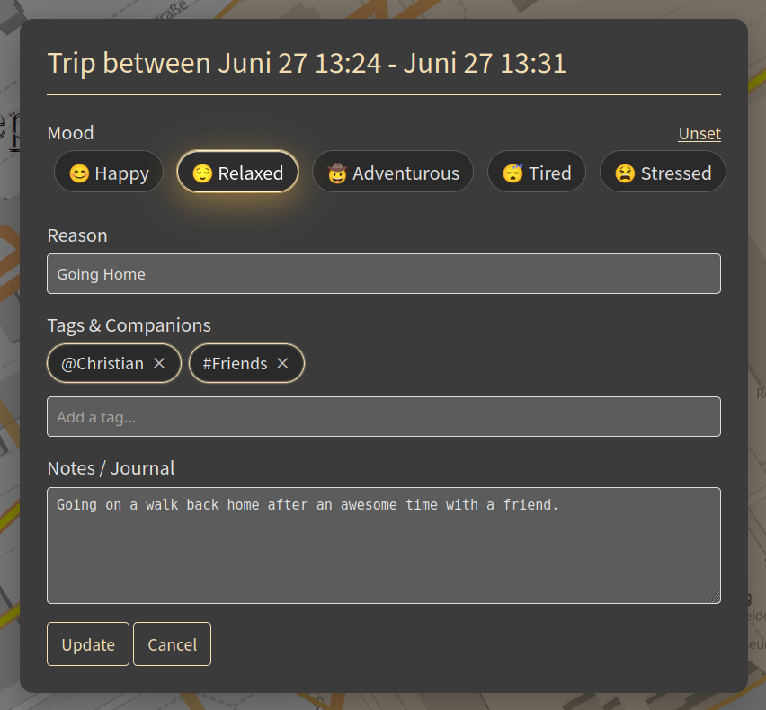
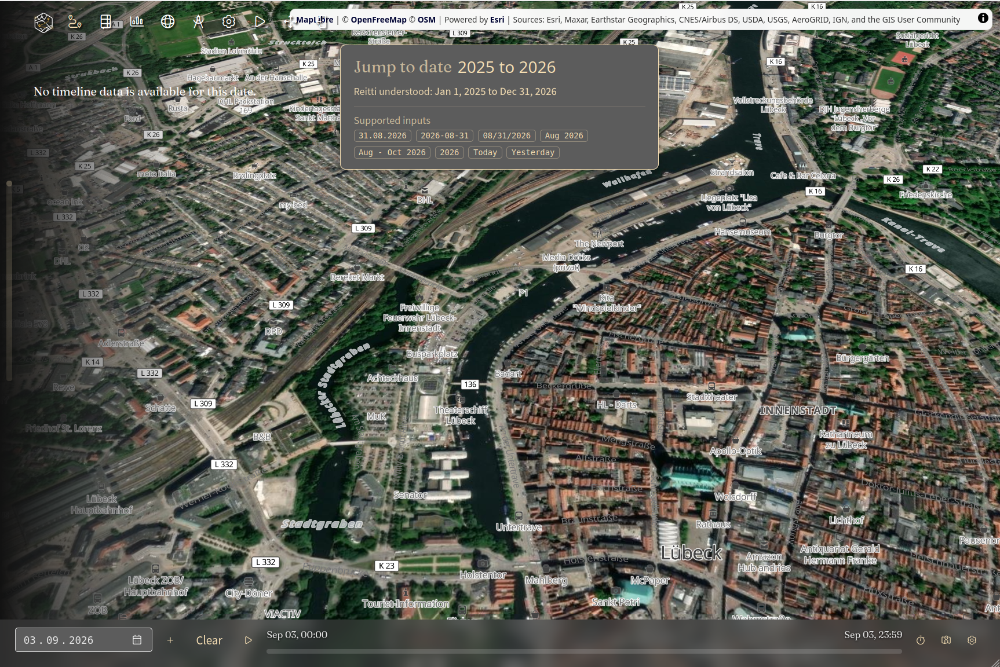
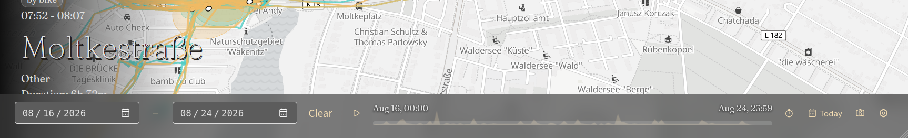
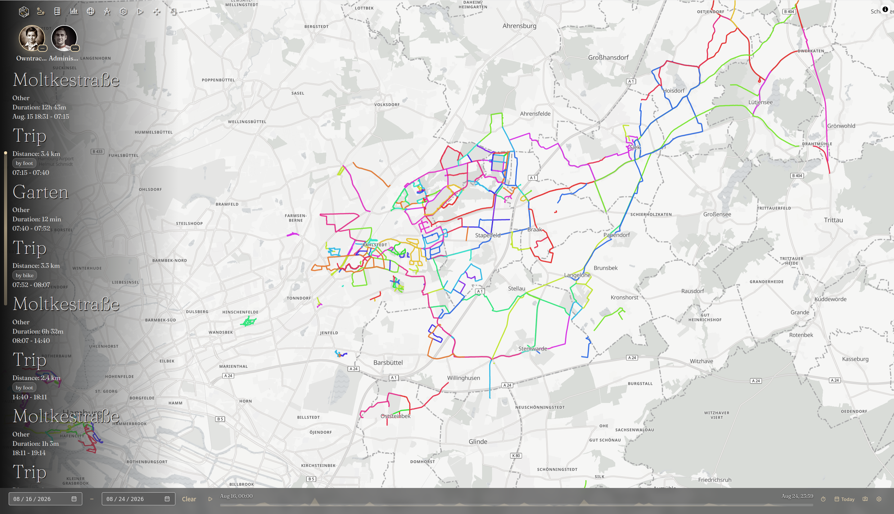
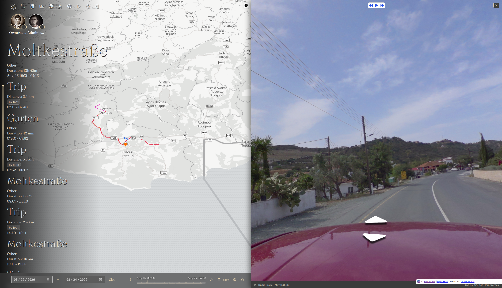
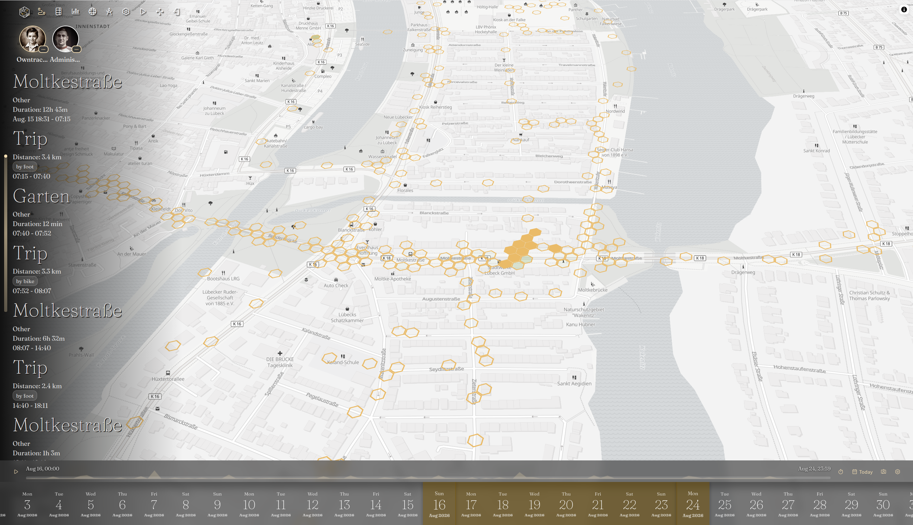
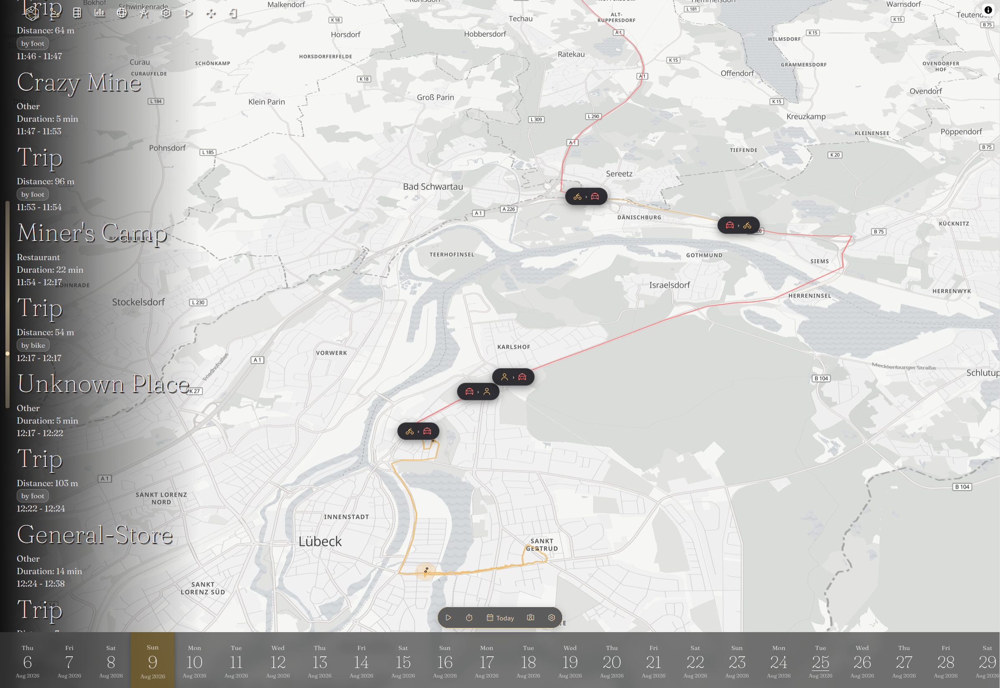

The main view is the central interface of Reitti where you can visualize and interact with your location data. This page provides an overview of its key components and features.

## Main Menu

Located in the top navigation bar, the main menu provides access to all major sections of Reitti:

- **Timeline**: The main view showing your location data on a map (this page)
- **Memories**: Create and manage location-based memories (see [Memories](../memories/index.md))
- **Workbench**: Merge different timelines from multiple devices. Edit single or multiple location points. (see [Workbench](workbench.md)
- **Statistics**: View detailed analytics of your movement patterns
- **Settings**: Configure application preferences and integrations
- **Enter Live-Mode**: Switch to real-time location tracking
- **Enter Fullscreen**: Expand the interface to fullscreen view
- **Logout**: Sign out of your Reitti account

## Timeline Component

The timeline component is located on the left side of the interface and displays your location history chronologically:

### User Switcher
If you have access to other users' data (via [Share Access](share-access.md) or [Reitti Integration](../integrations/reitti.md)) or more than one device configure (via [Devices](../configurations/devices.md)), a user switcher appears at the top of the timeline. This allows
you to:

- Switch between different users' timelines
- View location data for multiple users
- Compare movement patterns across users
- Clicking on a user or device avatar focuses the map on that user's or device location
- Enable follow user mode for a single user. This instructs reitti to focus only on this user during a page refresh.

### Chronological List
Below the user switcher, the timeline shows a chronological list of all visits and trips during the selected time range:
- **Visits**: Periods where you stayed at a specific location
- **Trips**: Movement between locations with transportation mode information. Trips can consist of multiple segments with different transportation modes (see [Transportation Mode Detection](../configurations/transportation-modes.md))

### Interactive Features
- **Click to Zoom**: Clicking on a timeline entry zooms the map to that element
  - For trips: Highlights the route on the map
  - For visits: Centers the map on the location
- **Click Again to Restore**: Clicking the same entry again restores the previous map view
- **Edit Visits**: When a visit is selected, hover over it to reveal an edit icon (pencil) that takes you to [Edit Place](place-edit.md)
- **Edit Trips**: When a trip is selected, hover over it and click the edit icon to open the **Edit Transport Modes** dialog, where you can adjust the transportation mode of each trip segment individually

### Metadata
You can enrich your visits and trips with metadata such as mood, tags, and notes. When a visit or trip is selected, hover over it to reveal a metadata icon (e.g., a smiley or note icon). Clicking the icon opens a dialog where you can:

- **Mood**: Select a mood from the following options:
  - 😊 Happy
  - 😌 Relaxed
  - 🧗 Adventurous
  - 😴 Tired
  - 😰 Stressed
- **Tags**: Add custom tags (e.g., "work", "commute", "weekend") to categorize the element.
- **Notes**: Attach free-form text notes for personal context.

 

## Date Picker

The date picker is a horizontal interface that allows flexible navigation through your location history. It displays dates as interactive elements with multiple modes and selection options:

### Date Selection
- **Single Date Selection**: Click on a date to select it, loading data and updating the timeline
- **Range Selection Mode**: Click a selected date again to enter range selection mode, then click another date to select a range
- **Range Modification**: In range selection mode, click any other date to change the range boundaries
- **Range Clearing**: In range selection mode, click the start or end date to clear the selection and exit range mode

### Navigation Methods
- **Horizontal Scrolling**: Drag the date slider left/right or use horizontal scroll to navigate through time
- **Mode Switching**: Scroll up/down to switch between different time granularity modes:
  - **Day Mode**: View individual days
  - **Month Mode**: View months
  - **Year Mode**: View years

### Drill-Down Navigation
When drilling into time periods:
- Scrolling into a year (e.g., 2024) aligns to January 2024
- Scrolling into a month (e.g., March 2024) aligns to March 1, 2024
- The date picker positions the selected period under the mouse cursor for intuitive navigation

### Advanced Range Selection
- **Year Ranges**: Select a year, click it again, then select another year to create a range from January 1 of the first year to December 31 of the second year
- **Month Ranges**: Similarly, select months to create ranges spanning from the first day of the first month to the last day of the second month
- **Arbitrary Ranges**: Combine different modes to create custom date ranges spanning days, months, or years

### Jump to Date by Typing

On the main page you can jump to any date or range simply by typing. Start typing anywhere on the page (letters, digits, `.`, `-`, `/`, or space) while no input field is focused, or click the **Jump to date** button in the top bar. A popup appears with your input and a live preview of what Reitti understood.

Supported inputs:

- **Locale date formats**: e.g. `31.08.2026`, `08/31/2026`, or `2026-08-31`
- **Month and year**: e.g. `Aug 2026`, jumping to the first day of that month
- **Years**: e.g. `2026`, jumping to January 1
- **Ranges**: e.g. `Aug - Oct 2026` or `2025 - 2026`, written with `-` or the localized word for "to"
- **Keywords**: `today` and `yesterday` (localized)

Key handling:

- **Enter**: Jumps to the recognized date or range
- **Tab**: Cycles through alternative interpretations when the input is ambiguous (e.g. `08/10` can mean August 10 or October 8, depending on your locale)
- **Escape**: Closes the popup without jumping

The preview updates as you type, so you always see where you will land before committing. Type-to-jump is not available while live mode is active.

### Traditional Date Inputs

As an alternative to the horizontal date band, the date picker can be switched to a more traditional, input-based navigation method:

1. Open the settings menu via the **Open Map Settings** button
2. Under **Interface**, set **Date Picker Style** to **Traditional Inputs**
3. The change applies immediately, replacing the date band with classic date inputs

In this mode you get:

- **Start Date Field**: A classic date input with an integrated calendar popup. Type a date or pick one from the calendar
- **Range Selection**: Click the **+** button to reveal a second field for the end date, turning your selection into a range. Click **−** to collapse back to a single date
- **Clear**: Resets the selection back to today
- **Immediate Apply**: Every change takes effect at once, the timeline and map update as soon as a date is picked

## View Control

The View Control component sits above the date picker and provides tools for controlling how your location data is visualized:

### Replay Controls
- **Start Replay**: Begins a replay of all your movements during the selected time range, animating your path on the map
- **Speed Control**: Adjusts the playback speed of the replay (slow, normal, fast, automatic, adaptive)
- **Time Control Slider**: When opened, displays a slider above the View Control that allows you to scrub through the replay time to show specific ranges of interest

### Today Button

- **Today**: Jumps to the current date and time, if not currently selected

### Map View Settings
The map view control allows you to customize the map display with various settings:

- **3D View**: Enable/disable the 3D perspective view of the map
- **Render Buildings**: Toggle building rendering for more detailed urban environments
- **Globe Projection**: Switch between flat map and globe projection views
- **Terrain Layer**: Enable/disable terrain elevation visualization
- **Satellite View**: Toggle between map and satellite imagery
- **Street Photos**: Show or hide the street-level imagery overlay powered by [Panoramax](https://panoramax.fr/) (see [Street Photos Layer](#street-photos-layer-panoramax))
- **North Alignment**: Align the map with true north (disables automatic rotation)

### Settings Menu
- **Open Settings**: Access the main view settings menu for additional customization options

## Street Photos Layer (Panoramax)

The map can display community-contributed street-level imagery as an overlay, powered by [Panoramax](https://panoramax.fr/), an open digital commons for geolocated photos. Enable it with the **Street Photos** button in the [View Control](#view-control).

### Sequences and Photos

Panoramax organizes its imagery on two levels:

- **Photos**: A single 360° capture taken at a specific position. Reitti only shows photos with a 360° field of view (equirectangular imagery), because only those provide a real street-level experience. Photos with a narrower field of view are hidden from the layer.
- **Sequences**: A collection of photos captured along a route, usually recorded in a single session, like a bike ride or a walk through the streets. A sequence groups its photos in capture order, so you can move through them one after another, like a virtual walk along the recorded route.

On the map, this translates to:

- **Sequences** are drawn as colored lines, with one color per sequence
- **Photos** appear as dots along those lines, marking each individual capture position
- When zoomed out, shaded overview blobs indicate regions that contain 360° coverage, so you can spot available imagery before zooming in

### Viewing Street Photos

- **Click a sequence line, a photo dot, or any spot on the map** to open the **Street Photos** panel. Reitti automatically selects the closest 360° photo to the position you clicked
- The panel contains an interactive 360° viewer. Use the player controls to navigate backwards and forwards through the photos of the sequence
- As you move through a sequence, the position marker on the map follows the photo you are currently viewing
- The bar at the bottom of the panel shows the photo's provider, the capture date, and a link to its license

!!! hint
    The **Street Photos** toggle only appears when a Panoramax endpoint is configured on your instance (`reitti.panoramax.base-url`, by default the public Panoramax API). The imagery is contributed by the Panoramax community and is subject to the respective licenses shown in the panel.

## Settings

The Settings menu provides comprehensive control over how your location data is displayed and analyzed:

### Path Display Modes
- **Standard**: Displays optimized paths that balance detail with performance by not overwhelming the browser with all points in the time range
- **Raw Path**: Displays all location data points without any optimizations, showing the complete raw data
- **Edge Bundling**: Bundles paths based on proximity, making it easy to visualize your most frequently used routes within the selected time range
- **Hexagon Grid**: Replaces paths and visits with the hexagon cells of the [H3 spatial indexing](../configurations/spatial-coverage.md) (see [Hexagon Grid Mode](#hexagon-grid-mode))

### Hexagon Grid Mode

The **Hexagon Grid** view mode hides paths and visits and instead renders the H3 hexagon cells of the [spatial indexing](../configurations/spatial-coverage.md). This mode is only available when spatial coverage is enabled on your instance.

- **Density at a Glance**: Every cell you have recorded location points in is drawn in your user color. The more points a cell contains, the more opaque it is drawn, so frequently visited areas light up while rarely visited cells stay faint
- **Zoom-Adaptive Resolution**: Cells are aggregated based on the current zoom level. Zoomed out you see large hexagons summarizing whole districts; zooming in splits them into smaller, more precise cells
- **Replay Support**: During a replay, cells fill up progressively as the replay passes their timestamps, visualizing how your coverage grew over the selected time range

### Transportation Mode Display

In the settings menu under **Map Appearance**, enable **Display Transportation Modes** to visualize the different transportation modes within your trips (see [Transportation Mode Detection](../configurations/transportation-modes.md)):

- **Segment Coloring**: Track segments are colored by the transportation mode used in that segment instead of a single uniform color
- **Transition Badges**: Where you switch modes (e.g. from walking to driving), a badge showing both mode icons appears on the track. Hover over it to see the details of the transition
- Badges are only shown when zoomed in far enough and for time ranges up to seven days; they are hidden in the 24-hour aggregate mode

### 24-Hour Aggregate Mode
When enabled, this feature aligns all times to the day, allowing you to:
- Analyze daily patterns by seeing which paths you typically take at specific times (e.g., 8 AM commute routes)
- Identify when you're most likely to be in certain locations during the evening
- When combined with the replay feature, all days in the selected time range are played simultaneously, showing aggregated daily patterns

### Interface Controls
- **Hide Timeline**: Toggle visibility of the timeline component on the left side
- **Hide Date Picker**: Toggle visibility of the date picker component
- **Date Picker Style**: Choose between the horizontal **Date Band** and **Traditional Inputs** (see [Traditional Date Inputs](#traditional-date-inputs))

## Live Mode

Live mode provides real-time tracking functionality with a kiosk-style display:

### Real-time Tracking
- **Automatic Updates**: The display automatically updates as soon as new location data arrives
- **Latest Locations**: Shows the most recent known location of you and all connected users
- **User Avatars**: Each user is represented by their avatar on the map
- **Hover Information**: Hover over an avatar to display additional information including when the data was last updated

### Multi-User Display
- **Connected Users**: View all users you have access to via [Share Access](share-access.md) or [Reitti Integration](../integrations/reitti.md)
- **Real-time Movement**: Watch as user locations update in real-time as they move

### Kiosk Mode
- **Continuous Display**: Ideal for wall-mounted displays or shared screens
- **Minimal Interface**: Clean, focused display optimized for at-a-glance viewing
- **Automatic Refresh**: No user interaction required to see updated locations

## Navigation Tips

- **Zoom Controls**: Use mouse wheel, +/- buttons, or double-click to zoom
- **Pan Navigation**: Click and drag to move around the map
- **Search Locations**: Use the search bar to find specific places
- **Fullscreen Mode**: Expand the map to fullscreen for better visibility
- **Quick Date Navigation**: Use the date picker's horizontal scroll and mode switching for efficient time travel
- **Type to Jump**: Start typing a date anywhere on the main page to jump directly to it (see [Jump to Date by Typing](#jump-to-date-by-typing))
- **Interactive Timeline**: Click timeline entries to zoom to specific locations or trips
- **Multi-User Switching**: Use the user switcher in the timeline to view different users' data

## Getting the Most from the Main View

1. **Analyze Daily Patterns**: Use **24-Hour Aggregate Mode** to identify your regular routines and commute patterns
2. **Explore Movement History**: Switch between **Standard**, **Raw Path**, **Edge Bundling**, and **Hexagon Grid** modes to analyze your movement data at different levels of detail
3. **Customize Your View**: Adjust map settings like **3D View**, **Terrain Layer**, and **Satellite View** to match your analysis needs
4. **Use Live Mode for Real-time Tracking**: Enable live tracking for current movement monitoring or set up a **Kiosk Mode** display for shared viewing
5. **Leverage Replay Features**: Use the **Replay Controls** with different speeds to review your movements over selected time ranges
6. **Compare Multi-User Data**: If you have access to other users' data, use the **User Switcher** to compare movement patterns and coordinate activities
7. **Walk the Streets Virtually**: Enable the **Street Photos** layer and click a route you traveled to see how it looked through the eyes of the Panoramax contributors

## View Mode Use Cases

- **Route Planning**: Use **Edge Bundling** mode to identify your most frequently traveled routes
- **Pattern Recognition**: Enable **24-Hour Aggregate Mode** to discover daily routines and habitual locations
- **Coverage Analysis**: Use the **Hexagon Grid** mode to see at a glance which areas you visit often and which you have barely explored
- **Presentation Mode**: Use **Fullscreen** with a simplified interface for sharing your location history with others
- **Real-time Monitoring**: **Live Mode** is ideal for tracking current movements or monitoring multiple users simultaneously