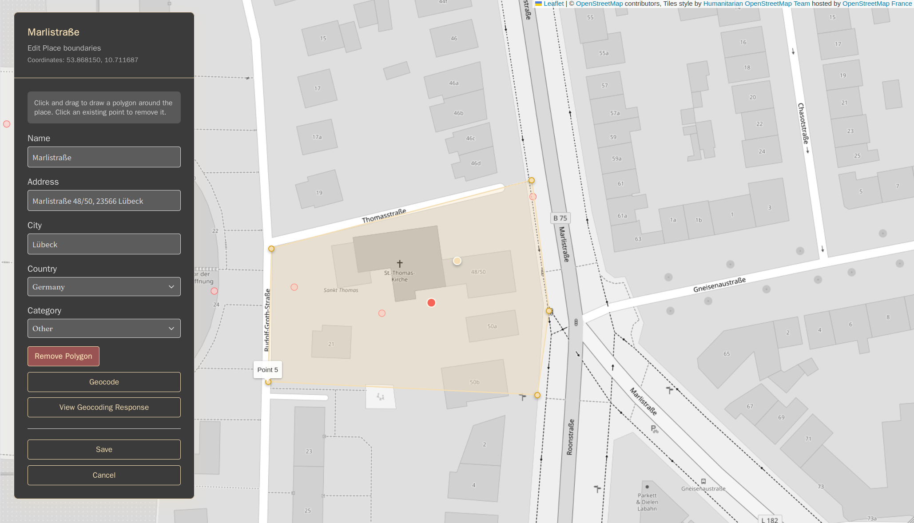
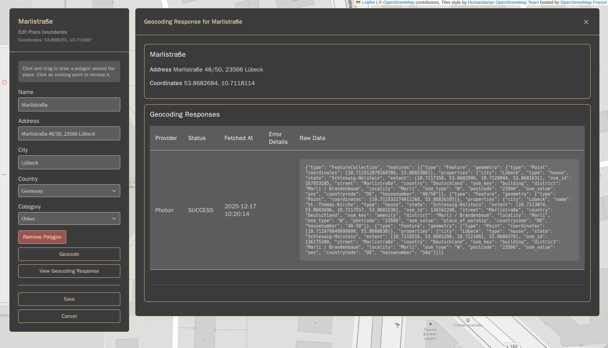
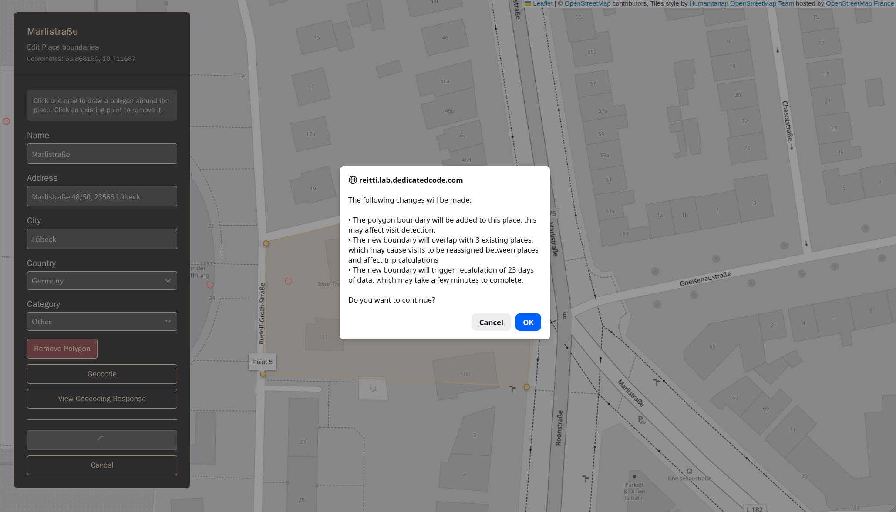

Reitti allows you to modify existing place information through two primary access points:

### Accessing Place Editing

#### Method 1: From the Timeline
1. Select a place in your timeline
2. Hover over the selected place
3. Click the **Edit** icon (pencil symbol) that appears

#### Method 2: Through Settings
1. Navigate to **Settings**
2. Select **Places** from the menu
3. Find the place you want to modify
4. Click the **Edit** button next to the place

### Editable Fields

When editing a place, you can modify the following fields:

- **Name**: The display name for the place
- **Address**: Street address information
- **City**: City name
- **Country**: Select from available countries
- **Category**: Choose a category for the place

### Polygon Boundaries

#### Adding Polygon Boundaries
1. Click on the map to add points
2. Each click creates a vertex in the polygon
3. The polygon will automatically close when you add at least 3 points

#### Modifying Polygon Boundaries
- Click on an existing point to remove it
- Continue clicking to add new points as needed

#### Polygon Management Buttons
- **Clear Polygon**: Removes all polygon points but keeps the boundary data
- **Remove Polygon**: Completely drops all boundary information

### Geocoding History

#### Viewing Past Responses
1. Click **"View Geocoding Response"** to open the geocoding drawer
2. The drawer displays all past reverse geocoding responses with:
   - **JSON**: The raw response data
   - **Provider**: Which geocoding service was used
   - **Status**: Success/failure status
   - **Timestamp**: When the geocoding occurred

### Boundary Change Warnings

When you make significant changes to polygon boundaries, Reitti will:

1. Detect potential conflicts with existing places
2. Calculate the impact of the changes
3. Present a warning dialog showing:
   - Number of days that will need recalculation
   - Number of places that will be dropped

### Saving Changes

After making your edits:
1. Review all changes carefully
2. Pay special attention to any boundary change warnings
3. Click **Save** to apply changes
4. Click **Cancel** to discard changes and exit

### Important Notes

- Boundary changes can significantly affect visit detection and place merging
- Polygon boundaries are used for accurate visit detection
- Consider the impact of boundary changes on historical data before saving
