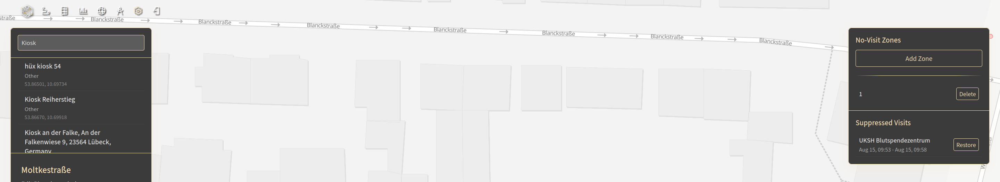
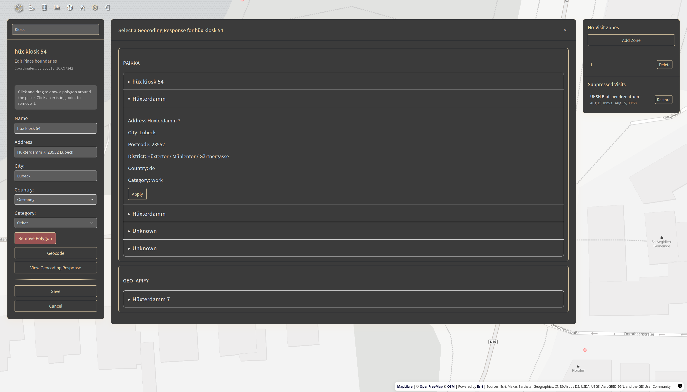
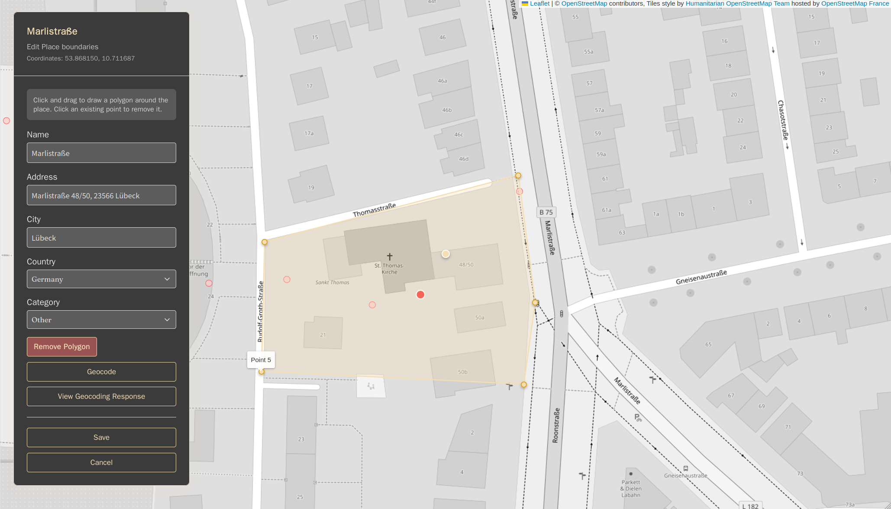
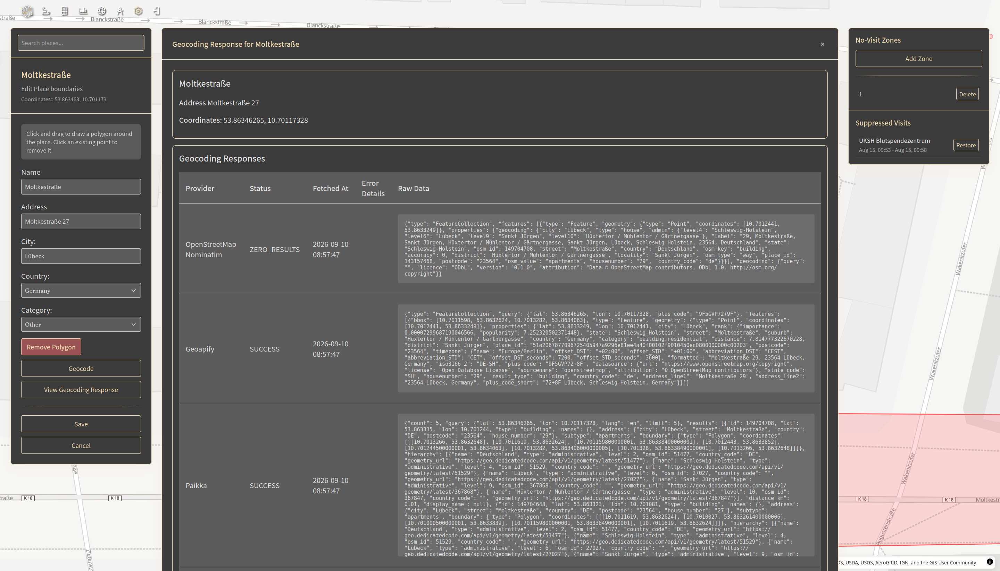
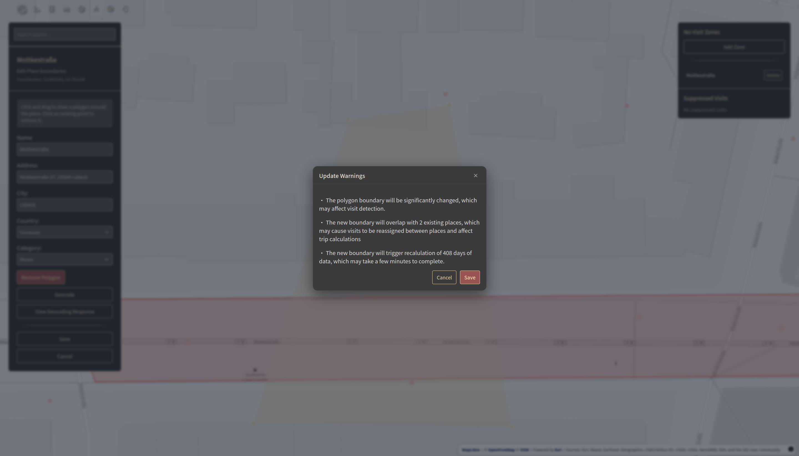
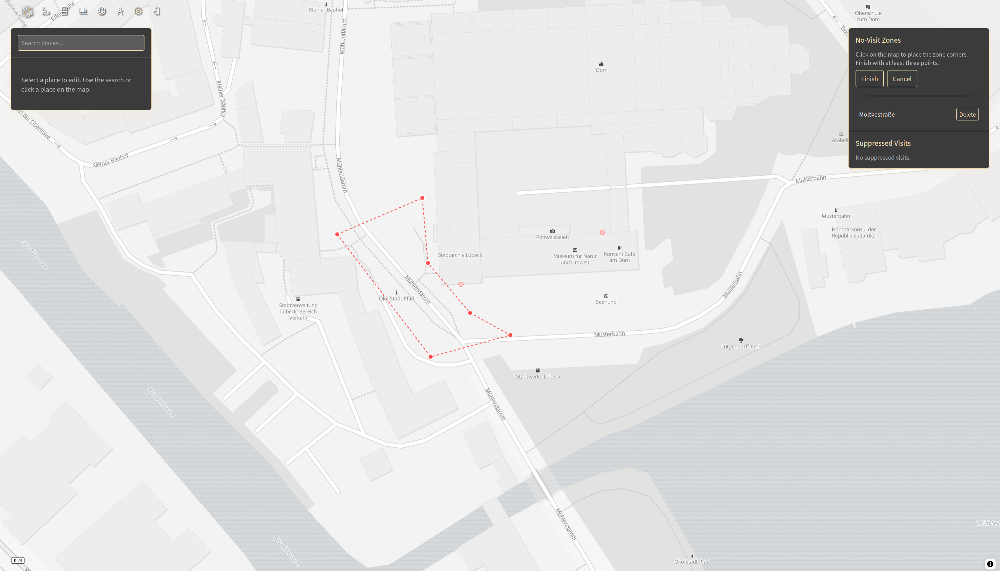
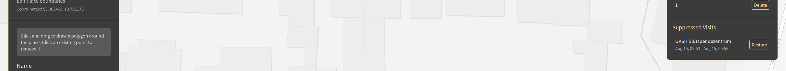

The Place Editor is the central tool to manage your significant places. You can edit place details and polygon
boundaries, find places quickly, create **No-Visit Zones**, and review **suppressed visits**.

### Accessing the Place Editor

#### Method 1: From the Timeline
1. Select a place in your timeline
2. Hover over the selected place
3. Click the **Edit** icon (pencil symbol) that appears

#### Method 2: Through Settings
1. Navigate to **Settings**
2. Select **Places** from the menu
3. Find the place you want to modify
4. Click the **Edit** button next to the place

#### Method 3: From Visit Sensitivity
|since|v5.5.0|.version-badge|

1. Navigate to **Settings > Visit Sensitivity**
2. Click the **Open Place Editor** button

### Finding Places
|since|v5.5.0|.version-badge|

Use the search field in the top left corner of the editor to find a place by its name. Selecting a search result
focuses the place on the map, so you can edit it right away.

### Editable Fields

When editing a place, you can modify the following fields:

- **Name**: The display name for the place
- **Address**: Street address information
- **City**: City name
- **Country**: Select from available countries
- **Category**: Choose a category for the place

### Reverse Geocoding a Place

When a place is selected, press the **Geocode** button to reverse geocode the place with all configured reverse
geocoders (see [Reverse Geocoding](../configurations/reverse-geocoding.md)). The results are displayed in a list grouped
by reverse geocoder, so you can compare what each service found for the place's location.

Press **Apply** on a result to copy the parsed response into the input fields of the place, such as name, address,
city, and country. Review the applied values and save the place as usual.

### Polygon Boundaries

#### Adding Polygon Boundaries
1. Click on the map to add points
2. Each click creates a vertex in the polygon
3. The polygon will automatically close when you add at least 3 points

#### Modifying Polygon Boundaries
- Click on an existing point to remove it
- Continue clicking to add new points as needed

#### Polygon Management Buttons
- **Clear Polygon**: Removes all polygon points but keeps the boundary data
- **Remove Polygon**: Completely drops all boundary information

### Geocoding History

#### Viewing Past Responses
1. Click **"View Geocoding Response"** to open the geocoding drawer
2. The drawer displays all past reverse geocoding responses with:
   - **JSON**: The raw response data
   - **Provider**: Which geocoding service was used
   - **Status**: Success/failure status
   - **Timestamp**: When the geocoding occurred

### Boundary Change Warnings

When you make significant changes to polygon boundaries, Reitti will:

1. Detect potential conflicts with existing places
2. Calculate the impact of the changes
3. Present a warning dialog showing:
   - Number of days that will need recalculation
   - Number of places that will be dropped

### Saving Changes

After making your edits:
1. Review all changes carefully
2. Pay special attention to any boundary change warnings
3. Click **Save** to apply changes
4. Click **Cancel** to discard changes and exit

### Important Notes

- Boundary changes can significantly affect visit detection and place merging
- Polygon boundaries are used for accurate visit detection
- Consider the impact of boundary changes on historical data before saving

### No-Visit Zones
|since|v5.5.0|.version-badge|

A **No-Visit Zone** is a drawn area in which Reitti never creates visits. When the location points inside the zone are
processed, the affected time ranges and locations are marked as suppressed, so no visits are created there. Trips and
paths through the area are not affected.

#### Creating a Zone

1. Press **Add Zone**
2. Draw a polygon on the map by clicking its vertices
3. Press **Finish** when the polygon is complete
4. Give the zone a name
5. Press **Save**

Creating a zone starts a recalculation job that recalculates all location points affected by the new zone.

#### Modifying a Zone

- **Move**: Click a zone to select it, then move it to a new position
- **Delete**: Remove the zone

Both actions trigger a recalculation job for all points affected by the change.

### Suppressed Visits
|since|v5.5.0|.version-badge|

Deleting a visit in the timeline (see [Main View](main-view.md)) is a *temporal deletion*: Reitti marks the place and
time range of that visit as suppressed instead of removing the underlying data. Recalculations of that time range will
not recreate the visit.

The Place Editor lists all suppressed visits of your account. Press **Restore** on a suppressed visit to undo the
suppression, so visit detection creates the visit again during the next recalculation.

### Monitoring Recalculations

Every action in the Place Editor that changes visit detection — creating, moving, or deleting a zone, and restoring a
suppressed visit — triggers a recalculation job. You can monitor the progress of all jobs under
**Settings > Job Status**. Once the jobs are done, the timeline displays your data with the new information.