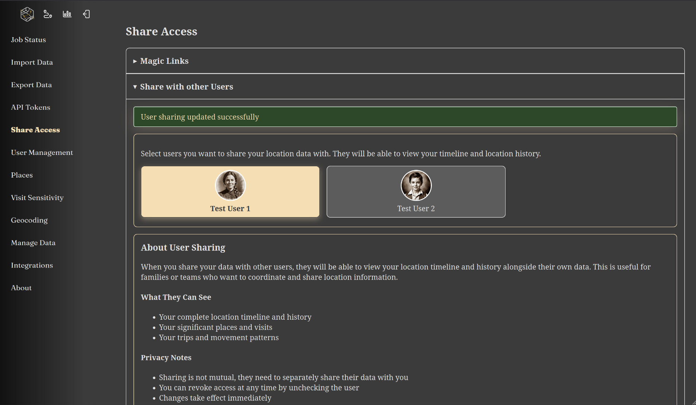
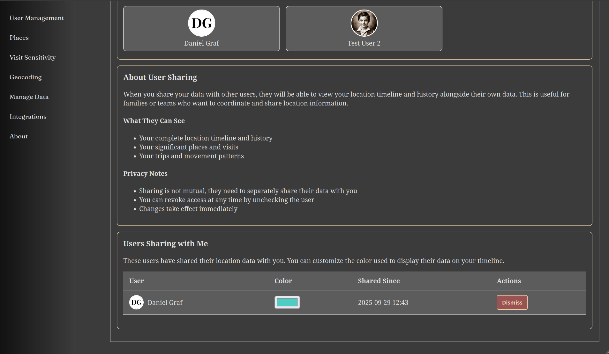

## Share Access with Magic Links

|since|v1.5.0|.version-badge|

Magic links allow you to share your location data with others without requiring them to create an account. Anyone with the link can access your data according to the permissions you set.

### How Magic Links Work

When you create a magic link, Reitti generates a unique URL that provides access to your location data. The person receiving the link can view your data in their browser without needing to sign up or log in. When the link is accessed, a partial user session is created that allows viewing your data according to the access level you've configured.

### Creating a Magic Link

To create a magic link:

1. Navigate to the sharing section in your Reitti dashboard
2. Click "Create New Magic Link"
3. Choose your desired access level (see below)
4. Optionally set an expiration date
5. Click "Generate Link"
6. Copy and share the generated URL

### Access Levels

You can choose between two access levels when creating a magic link:

#### Full Access

- Complete access to all your location data and history
- Recipients can view the full map interface
- Date picker functionality is available
- Access to historical location data

#### Live Data Only

- Access only to current and recent location data
- Recipients can only view live/real-time location information
- No access to historical data
- Limited to live mode interface

### Expiration Settings

When creating a magic link, you can:

- **Set an expiration date**: The link will automatically become invalid after the specified date
- **Leave it empty**: The link will remain active indefinitely until manually deleted

Setting expiration dates is recommended for temporary sharing to limit access duration.

### Security Considerations

⚠️ **Important Security Notes:**

- **Treat links like passwords**: Anyone with the link can access your data according to the permissions set
- **Links cannot be recovered**: If you lose a magic link, you'll need to create a new one
- **Monitor usage**: Check the 'Last Used' column regularly to track when links are being accessed
- **Delete unused links**: Remove links immediately when they're no longer needed
- **Use expiration dates**: Set expiry dates for temporary sharing to automatically limit access

### Managing Magic Links

#### Viewing Active Links
You can view all your active magic links in the sharing dashboard, which shows:

- Link creation date
- Access level (Full Access or Live Data Only)
- Expiration date (if set)
- Last used timestamp

#### Deleting Links
To revoke access:

1. Navigate to your magic links list
2. Find the link you want to delete
3. Click the delete/revoke button
4. Confirm the deletion

Once deleted, the link will immediately become invalid and anyone trying to access it will receive an error.

### Best Practices

- **Regular cleanup**: Periodically review and delete unused magic links
- **Specific permissions**: Use "Live Data Only" when full historical access isn't needed
- **Temporary sharing**: Always set expiration dates for short-term sharing needs
- **Monitor access**: Keep an eye on the 'Last Used' timestamps to detect unexpected usage
- **Secure sharing**: Share links through secure channels (encrypted messaging, etc.)

### Troubleshooting

#### Link Not Working
- Check if the link has expired
- Verify the link was copied completely
- Ensure the link hasn't been deleted

#### Access Issues
- Confirm the recipient is using a supported browser
- Check if there are any network connectivity issues
- Verify the access level meets the recipient's needs

#### Security Concerns
- If you suspect unauthorized access, immediately delete the compromised link
- Create a new link with appropriate restrictions
- Consider using shorter expiration periods for sensitive data

## Share Access to other Users
|since|v1.7.0|.version-badge|

In addition to magic links, you can share your location data directly with other registered users on the same Reitti instance. This feature allows for seamless collaboration and data sharing within your organization or group.

### Sharing Your Data with Other Users

To share your location data with other users:

1. Navigate to **Settings > Share Access > Share with other Users**
2. Browse or search for the users you want to share with
3. Select the users from the list
4. Choose the appropriate access level for each user
5. Save your sharing preferences

Once configured, the selected users will be able to view your location data according to the permissions you've granted them.

### Managing Shared Accounts

The Share Access page also displays accounts that are currently sharing their data with you. This section provides several management options:

#### Viewing Shared Accounts
You can see a list of all users who have shared their location data with you, including:

- Username or display name
- Sharing permissions level
- Current color assignment for map display

#### Customizing the Multi-User Map View

To optimize the multi-user map experience:

**Change User Colors:**

- Each shared user is assigned a color for their location markers and tracks
- Click on a user's color indicator to change it
- Choose colors that provide good contrast and visual distinction
- This helps differentiate between multiple users when viewing the map

**Dismiss Shared Accounts:**

- If you no longer want to see a particular user's data
- Click the "dismiss" button next to their entry
- This will hide their data from your map view
- Note: This only affects your view, it doesn't revoke their sharing permissions

### Best Practices for User Sharing

- **Regular review**: Periodically check who has access to your data
- **Appropriate permissions**: Only grant the minimum access level needed
- **Color coordination**: Use distinct colors for each user to avoid confusion on multi-user maps
- **Communication**: Coordinate with your team about sharing preferences and color choices

### Privacy Considerations

- **Mutual consent**: Ensure all parties agree to data sharing arrangements
- **Regular cleanup**: Remove sharing permissions when they're no longer needed
- **Access monitoring**: Keep track of who has access to your location data

