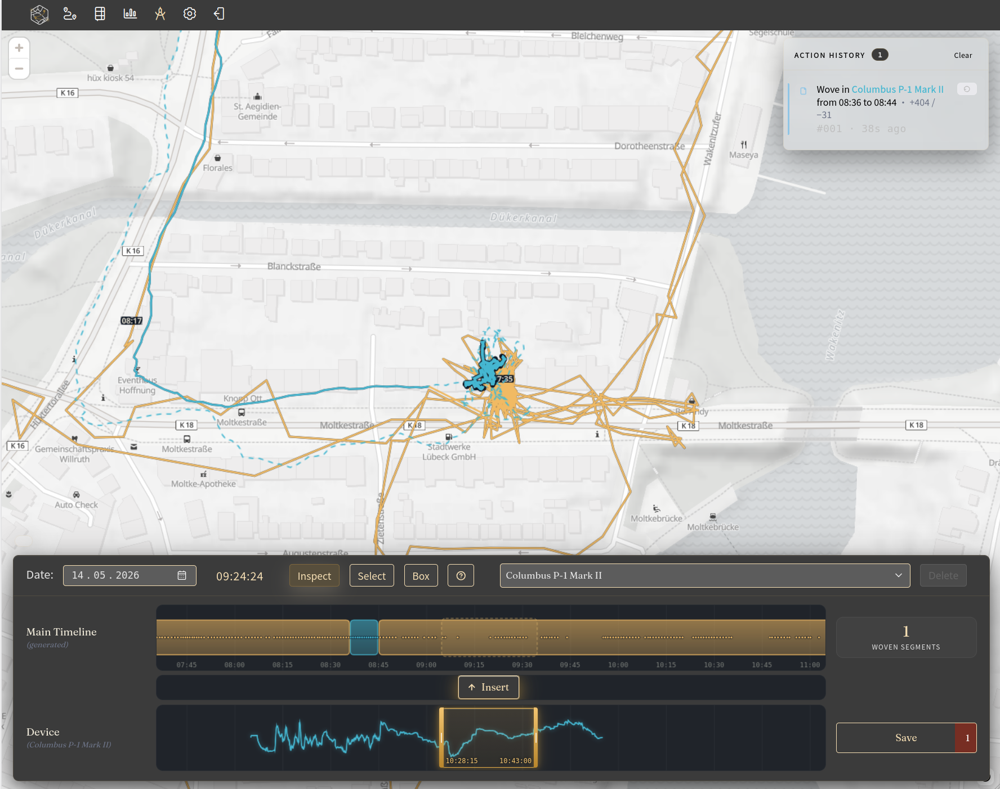
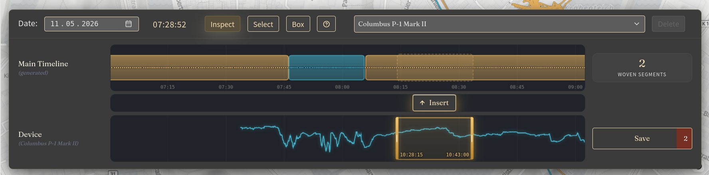
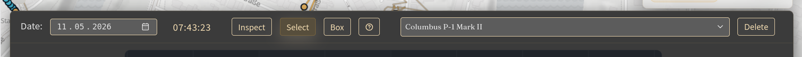

|since|v5.0.0|.version-badge|

The **Workbench** is Reitti's tool for merging and editing location data from multiple devices. It allows you to combine GPS data from different sources into your personal timeline, giving you full control over which data points are included.

## Overview

The Workbench consists of two main areas:

- **Map Area** – Displays the path of the selected day ± 24 hours
- **Stitching Area** – A synced area with two timelines for merging data

### Map Area

The map shows the selected device's path for the chosen day, with a ±24-hour window around it. When you select a timeframe in the stitching area, the corresponding path is highlighted on the map.

### Stitching Area

The stitching area is synced to the map and contains two timelines:

- **Upper Timeline** – Displays data from your **main timeline** (the default device)
- **Lower Timeline** – Displays data from the **selected device**

Both timelines show the same time range, allowing you to compare and merge data.

## Stitching Process

1. **Select a device** – Use the device picker to choose which device's data you want to merge
2. **Select a timeframe** – A slider overlays the device timeline, allowing you to:
    - Move the start and end points independently
    - Move the entire timeframe selection as a unit
3. **Preview on map** – The selected timeframe is highlighted on the map
4. **Insert** – Press the **Insert** button to add this slice to your main timeline
5. **Save** – All actions are performed locally. Only when you press **Save** are changes persisted to the server
6. **Recalculation** – After saving, all necessary data is recalculated. You can monitor progress under **Settings > Job Status**

## Stitching Area Controls

The lower timeline area includes the following controls:

### Date Picker

A date picker for navigating through the selected device's data.

### Selection Mode

Three modes for interacting with GPS data:

| Key | Mode        | Description                                  |
|-----|-------------|----------------------------------------------|
| `1` | **Inspect** | View details of individual GPS points        |
| `2` | **Select**  | Select individual GPS points for editing     |
| `3` | **Box**     | Select multiple points using a box selection |

### Help Menu

The help menu provides keyboard shortcuts and tool descriptions.

#### Keyboard Shortcuts

**Selection**

| Shortcut                          | Action                                   |
|-----------------------------------|------------------------------------------|
| `Ctrl` + `←` / `→`                | Previous / next point                    |
| `Ctrl` + `Shift` + `←` / `→`      | Extend selection by one point            |
| `Ctrl` + `Home` / `End`           | Jump to first / last point in the window |
| `Ctrl` + `Shift` + `Home` / `End` | Extend selection to start / end          |
| `Ctrl` + `A`                      | Select all points in the editable window |
| `Esc`                             | Clear selection                          |

**Editing**

| Shortcut | Action                 |
|----------|------------------------|
| `Delete` | Remove selected points |

> **Note:** On macOS, `Cmd` works in place of `Ctrl`.

### Device Picker

Select which device's data you want to work with.

### Delete Button

Removes selected GPS points from the map.

### Moving Points

After selecting a GPS point, you can drag it to a new location on the map. This allows you to correct inaccurate location data.

## Saving and Persistence

All edits are performed **locally** in the browser. Changes are only saved to the server when you:

1. Press the **Save** button
2. Confirm the save action

After saving, the server recalculates your timeline. You can monitor the progress under **Settings > Job Status**.

## Use Cases

- **Correcting GPS drift** – Move inaccurate points to their correct location
- **Merging multiple devices** – Combine data from a phone and a car tracker into one timeline
- **Removing unwanted data** – Delete specific GPS points that should not appear in your timeline
- **Stitching time slices** – Select a timeframe from one device and insert it into your main timeline

## Best Practices

- **Use the preview** – Always check the map before inserting data
- **Save frequently** – Save your changes regularly to avoid losing work
- **Monitor job status** – Check **Settings > Job Status** to see when recalculations are complete
- **Start with small selections** – Begin with a small timeframe to verify the merge works correctly
